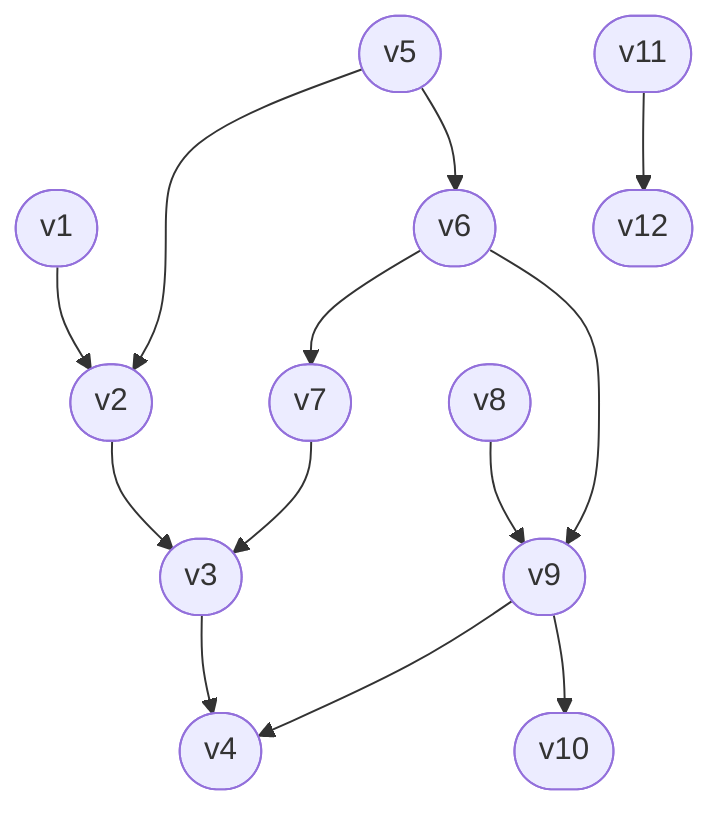

# 東京大学 新領域創成科学研究科 メディカル情報生命専攻 2024年8月実施 問題9

## **Author**
祭音Myyura

## **Description**
ゲノム解析パイプラインにおける計算タスク間の依存関係を有向非巡回グラフ $G = (V, E)$ で表す。
頂点 $v \in V$ は個々の計算タスクを表している。計算タスク $v_i$ の出力を計算タスク $v_j$ の入力とするために $v_j$ より先に $v_i$ の計算が終了している必要がある場合には辺 $v_i \to v_j$ を加えて依存関係の制約を表す。
グラフ $G$ は非巡回グラフであり、閉路を含まない。

(1) 計算タスクの順列であって依存関係の制約に違反しない計算順序を「正しい計算順序」と呼ぶことにする。以下のグラフにおいて、正しい計算順序を１つ示せ。

(2) 任意の有向非巡回グラフ $G$ が与えられたとき、正しい計算順序を一つ出力する時間計算量 $O(|V| + |E|)$ のアルゴリズムを示せ。ただし、入力グラフは隣接リスト表現で与えられており、$|V|$、$|E|$ はそれぞれ $V$、$E$ の要素数を表す。

(3) 任意の有向非巡回グラフ $G = (V, E)$ および各計算タスク $v \in V$ に対して非負の計算時間 $T(v)$ が与えられている。計算機は無限にあり、計算タスクは任意の数だけ同時並行で実行できるものとする。また、計算機間でデータを移動するための通信時間は無視する。依存関係の制約に違反せずに全ての計算が終わるまでの最短時間を求める時間計算量 $O(|V| +|E|)$ のアルゴリズムを示せ。ただし、入力グラフは隣接リスト表現で与えられているものとする。

## **Kai**
### (1)
解答例: v1, v5, v8, v11, v2, v6, v12, v7, v9, v3, v10, v4

### (2)
アルゴリズムの手順:

1. 初期化: 各頂点 $v \in V$ の入次数（自身を終点とする辺の数）を計算し、配列などに保存する。キューの準備: 入次数が0のすべての頂点をキュー $Q$ に追加する。
2. リストの準備: 計算順序を記録するための空のリスト $L$ を用意する。
3. 探索処理: キュー $Q$ が空になるまで以下の操作を繰り返す。
   1. $Q$ から頂点 $u$ を取り出し、$L$ の末尾に追加する。
   2. グラフの隣接リストを参照し、$u$ を始点とする各辺 $u \to v$ について、頂点 $v$ の入次数を1減らす。
   3. 入次数が0になった頂点 $v$ があれば、それを $Q$ に追加する。
4. 出力: リスト $L$ を正しい計算順序として出力する。

時間計算量の見積もり:
- ステップ1の入次数の計算は、すべての辺を1回ずつ調べるため $O(|V| + |E|)$ です。
- ステップ4のループ処理では、各頂点が正確に1回キューに入り、$L$ に追加されるため $O(|V|)$、各辺 $u \to v$ も始点 $u$ が処理される際に正確に1回評価されるため $O(|E|)$ です。
- したがって、全体の時間計算量は $O(|V| + |E|)$ となります。

### (3)
無限の計算機があり並行処理が可能な場合、全体の最短計算時間は「DAG上の最長経路（クリティカルパス）」の長さに等しくなります。

アルゴリズムの手順:
1. (2)のアルゴリズムを実行し、グラフ $G$ の頂点をトポロジカルソートした順序のリスト $L$ を取得する。
2. 各頂点 $v$ の「計算が完了する最短時間」を保持する配列 $dp$ を用意し、すべての $v \in V$ について $dp[v] = T(v)$ で初期化する。
3. トポロジカルソートされたリスト $L$ の先頭から順に頂点 $u$ を取り出し、以下の更新処理を行う。
   1. 隣接リストを参照し、$u$ から出る各辺 $u \to v$ の先の頂点 $v$ について、以下の漸化式で完了時間を更新する。
   
   $$
   dp[v] = \max(dp[v], dp[u] + T(v))
   $$
   
   （これは、$v$ の計算を始めるためには、先行するすべてのタスク $u$ の計算が終わるのを待つ必要があるためです）
4. すべての頂点の処理が終わった後、配列 $dp$ に格納されている値の最大値 $\max_{v \in V} dp[v]$ を求めて出力する。これが全体の最短完了時間となる。

時間計算量の見積もり:
- ステップ1のトポロジカルソートは $O(|V| + |E|)$ です。
- ステップ2の初期化は $O(|V|)$ です。
- ステップ3の更新処理では、トポロジカルソートの順に各頂点を1回ずつ訪問し、その頂点から出るすべての辺を1回ずつ評価するため、全体で $O(|V| + |E|)$ です。
- ステップ4の最大値の探索は $O(|V|)$ です。したがって、全体の時間計算量は $O(|V| + |E|)$ となります。
