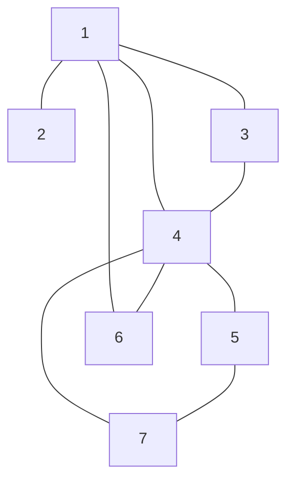
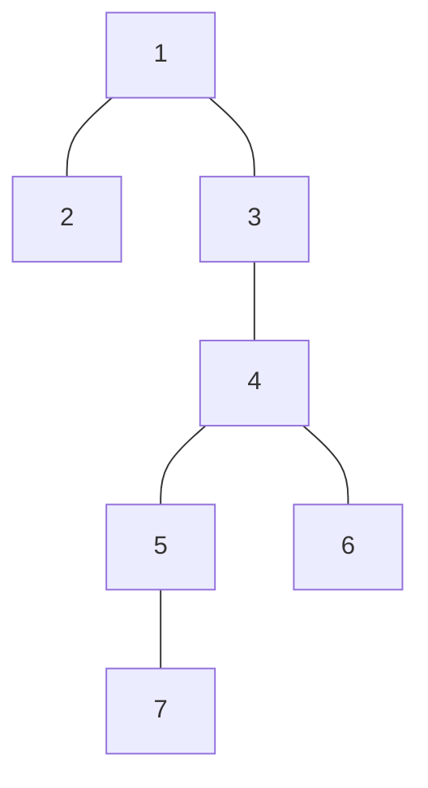

# 東京大学 新領域創成科学研究科 メディカル情報生命専攻 2025年8月実施 問題8

## **Author**
祭音Myyura

## **Description**
$G$ を単純連結無向グラフとする。以下の問いに答えよ。

(1) 以下のグラフ $G_0$ について点 `1` を根とする深さ優先探索木 $T_0$ をひとつ描け。

(2) $T$ を $G$ の深さ優先探索木とする。$G$ の辺 $(v, w)$ が、$T$ の辺に含まれないとき、$w$ は $T$ 内の $v$ の祖先か子孫のいずれかの点であることを示せ。

$G$ の点 $v$ を取り除くとグラフが非連結になるとき、$v$ を関節点という。

(3) (1) の $G_0$ について関節点を全て求めよ。

(4) $v$ は $T$ の根とする。$v$ が $T$ 上で２つ以上の子を持つとき、$v$ は関節点であることを示せ。

(5) $v$ は $T$ の根でないとする。以下の条件(A)を満たす $T$ 上の $v$ の子 $v_c$ があるとき、$v$ は関節点で
あることを示せ。

- 条件(A): $G$ の辺で、$T$ 上の $v$ の祖先と、$v_c$ かその子孫とをつなぐものは一つもない。

## **Kai**
### (1)

### (2)
$G$ の辺 $(v, w)$ が $T$ の辺（木辺）に含まれないと仮定する。一般性を失わず、DFSの探索において頂点 $v$ が $w$ よりも先に発見（訪問）されたとする。

$v$ の探索中、それに接続する辺 $(v, w)$ も必ず走査される。このとき $w$ がまだ訪問されていなければ、辺 $(v, w)$ を経由して $w$ を訪問することになるため、$(v, w)$ は $T$ の辺として追加されるはずである。しかし、前提より $(v, w)$ は $T$ に含まれないため、$v$ から $(v, w)$ を走査した時点で、$w$ はすでに「訪問済み」でなければならない。

つまり、$w$ は「$v$ が発見された後」かつ「$v$ の探索処理が完了する前」に訪問されたことになる。DFSの性質上、これは $w$ が $v$ を始点とする再帰的な探索の過程で発見されたことを意味し、$T$ において $w$ は $v$ の子孫となる。したがって、$w$ は $T$ 内の $v$ の子孫（$w$ を先に発見したと仮定した場合は祖先）のいずれかである。

### (3)
$G_0$ の関節点は 1, 4 である。

### (4)
$v$ を $T$ の根とし、$v$ が $T$ 上で2つの子 $c_1, c_2$ を持つとする。

$T$ において、$c_1$ を根とする部分木を $T_1$、$c_2$ を根とする部分木を $T_2$ とする。木構造の性質上、これらは互いに素な頂点集合を持つ。

(2)で証明した通り、$G$ のすべての非木辺は祖先と子孫を結ぶ（後退辺である）ため、互いに祖先・子孫の関係にない $T_1$ の頂点と $T_2$ の頂点を直接結ぶ辺（交差辺）は $G$ には一切存在しない。

したがって、グラフ $G$ において $T_1$ 内の任意の頂点から $T_2$ 内の任意の頂点への経路は、必ず双方の共通の祖先である根 $v$ を経由しなければならない。グラフ $G$ から $v$ を取り除くと、$T_1$ と $T_2$ を結ぶ経路が完全に失われるため、グラフは非連結となる。よって、$v$ は関節点である。

### (5)
$v$ を $T$ の根ではない頂点とし、$v_c$ を条件(A)を満たす $v$ の子とする。
$T$ において $v_c$ を根とする部分木を $T_c$ とする。

$v$ がグラフ $G$ から取り除かれた場合を考える。(2)より $G$ には交差辺が存在しないため、$T_c$ 内の頂点から $T_c$ 外の頂点へ向かう辺は、$T_c$ 内から自身の祖先へ向かう後退辺のみに限られる。

$T_c$ 内の頂点の祖先は、$v$ 自身、または $v$ より上位の祖先である。しかし、条件(A)より、$T_c$ 内の頂点から $v$ の祖先へ直接つながる辺は一つも存在しない。ゆえに、$T_c$ 内の頂点から $v$ の祖先（$v$ が根でないため、少なくとも根が一つ存在する）への経路は、すべて $v$ を経由しなければならない。

$v$ を取り除くと、$T_c$ に属する頂点は $v$ の祖先を含む他のグラフ成分から完全に切り離され、グラフは非連結となる。よって、$v$ は関節点である。
