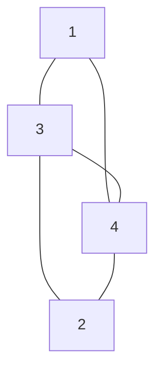

# 東京大学 新領域創成科学研究科 メディカル情報生命専攻 2026年1月実施 問題8

## **Author**
祭音Myyura

## **Description**
$G = (V, E)$ を点集合 $V$、辺集合 $E$ の単純連結無向グラフとする。$V$ の要素数を $n$ とする。$V$ を 2 分割したもの $C=(S,T)$ を $G$ のカットと呼ぶ。

ここで $S$ と $T$ は $S \subset V$, $T \subset V$, $S \neq \empty$, $T \neq \empty$, $S \cap T = \emptyset$,$S \cup T=V$ を満たし、$S$ と $T$ を入れ替えたペア
$(S, T)$、$(T,S)$ は区別しないものとする。カット $C$ のカットサイズを $S$ と $T$ をまたぐ辺の個数として定義する。また、カットサイズ $s$ をもつカットの個数を $s$ の重複度 $m(s)$ と定義する。以下の問に導出も含めて答えよ。

(1) 以下のグラフ $G_0$ について、全ての可能なカットサイズ $s$ とその重複度 $m(s)$ を求めよ。 

(2) $G$ が完全グラフ、すなわち $V=\{1, \ldots, n\}, E =\{(i,j) \mid i,j = 1,\ldots,n,i <j \}$ のとき、可能なカットサイ
ズ $s$ とその重複度 $m(s)$ を全て求めよ。

(3) $G$ が環状グラフ、すなわち $V=\{1, \ldots ,n\}, E =\{(i,i+1) \mid i =1,\ldots,n−1\} \cup \{(n,1)\}$ のとき、カットサイズの最小値 $s_{\min}$ とその重複度 $m(s_\text{min})$ を求めよ。

(4) $G$ の最小カットサイズ $s_{\min}$ をもつカットの一つを $C_\text{min} = (S_{\min}, T_{\min})$ とする。このとき $E$ の中で、$S_{\min}$ と $T_{\min}$ をまたぐ辺の割合は $2/n$ 以下であることを示せ。必要であれば、性質 $|E|= \sum_{v \in V} \text{deg}(v)/2$ を用いてもよい。ただし、$|E|$ は $E$ の要素数、$\text{deg}(v)$ は点 $v$ に接続する辺の数を表す。

## **Kai**
### (1)
$|S|=1, |T|=3$ の場合（4通り）
- $S=\{1\}, T=\{2,3,4\}$ : カットされる辺は $(1,3), (1,4)$。$s = 2$
- $S=\{2\}, T=\{1,3,4\}$ : カットされる辺は $(2,3), (2,4)$。$s = 2$
- $S=\{3\}, T=\{1,2,4\}$ : カットされる辺は $(3,1), (3,2), (3,4)$。$s = 3$
- $S=\{4\}, T=\{1,2,3\}$ : カットされる辺は $(4,1), (4,2), (4,3)$。$s = 3$

$|S|=2, |T|=2$ の場合（3通り）

- $S=\{1,2\}, T=\{3,4\}$ : カットされる辺は $(1,3), (1,4), (2,3), (2,4)$。$s = 4$
- $S=\{1,3\}, T=\{2,4\}$ : カットされる辺は $(1,4), (3,2), (3,4)$。$s = 3$
- $S=\{1,4\}, T=\{2,3\}$ : カットされる辺は $(1,3), (4,2), (4,3)$。$s = 3$

以上の結果から、可能なカットサイズ $s$ とその重複度 $m(s)$ は以下のようになります。

- $s = 2$ のとき、$m(2) = 2$
- $s = 3$ のとき、$m(3) = 4$
- $s = 4$ のとき、$m(4) = 1$

### (2)
$G$ が完全グラフの場合、任意の2頂点間に辺が存在します。
カット $C = (S, T)$ において、$S$ の要素数を $k$（ただし $1 \le k \le n-1$）、$T$ の要素数を $n-k$ とします。

$S$ に属する $k$ 個の頂点のそれぞれは、$T$ に属する $n-k$ 個の頂点すべてと辺で結ばれているため、カットサイズ $s$ は $k$ にのみ依存し、次のように表されます。

$$
s = k(n-k)
$$

ここで、$(S, T)$ と $(T, S)$ の区別はないため、$k$ の範囲を $1 \le k \le \lfloor n/2 \rfloor$ に限定してすべてのカットを網羅できます。

重複度 $m(s)$ は、$n$ 個の頂点から要素数 $k$ の集合 $S$ を選ぶ組み合わせの数に基づきます。

$k < n/2$ の場合:

$S$ を選ぶごとに一意のカットが定まるため、組み合わせの数がそのまま重複度になります。

$$
m(k(n-k)) = \binom{n}{k}
$$

$k = n/2$ の場合（$n$ が偶数のときのみ存在）:

$S$ を選ぶ操作において、ある集合を選んだ場合と、その補集合を選んだ場合とで同じカットを2回数え上げてしまうため、$1/2$ 倍する必要があります。

$$
m(k(n-k)) = \frac{1}{2} \binom{n}{n/2}
$$

### (3)
頂点集合を $S$ と $T$ に分割したとき、グラフの輪をたどると、$S$ の頂点から $T$ の頂点へ移動する回数と、$T$ の頂点から $S$ の頂点へ戻る回数は必ず等しくなります。したがって、環状グラフにおける任意のカットサイズは必ず 偶数 になります。

$S \neq \emptyset, T \neq \emptyset$ であり、グラフは連結しているためカットサイズが $0$ になることはありません。よって、正の偶数の最小値である $s_{\min} = 2$ が最小カットサイズとなります。

カットサイズが $2$ になるということは、環状グラフを構成する $n$ 本の辺の中から、切断する2本の辺を選ぶことと同義です。どの2本を選んでもグラフは2つの部分集合に分割されるため、重複度は $n$ 本の辺から2本を選ぶ組み合わせの数になります。

$$
m(s_{\min}) = \binom{n}{2} = \frac{n(n-1)}{2}
$$

### (4)
グラフ $G$ の各頂点 $v\in V$ に対して、その頂点 1 つだけを片側に取るカット

$$
C_v=({v},V\setminus{v})
$$

を考える。このカットのカットサイズは、頂点 $v$ に接続している辺の本数に等しいので、

$$
|C_v|=\deg(v)
$$

である。最小カットサイズ $s_{\min}$ は、すべてのカットサイズの中での最小値であるから、任意の頂点 $v\in V$ に対して

$$
s_{\min}\le \deg(v)
$$

が成り立つ。この不等式をすべての頂点 $v\in V$ について足し合わせると、

$$
\sum_{v\in V}s_{\min}\le \sum_{v\in V}\deg(v)
$$

となる。左辺は $s_{\min}$ を $n$ 回足したものなので、

$$
n s_{\min}\le \sum_{v\in V}\deg(v)
$$

である。また、握手補題より

$$
\sum_{v\in V}\deg(v)=2|E|
$$

であるから、

$$
n s_{\min}\le 2|E|
$$

を得る。両辺を $n|E|$ で割ると、

$$
\frac{s_{\min}}{|E|}\le \frac{2}{n}
$$

となる。ここで、最小カット $C_{\min}=(S_{\min},T_{\min})$ のカットサイズは $s_{\min}$ であるため、$S_{\min}$ と $T_{\min}$ をまたぐ辺の割合は

$$
\frac{s_{\min}}{|E|}
$$

である。したがって、この割合は $2/n$ 以下であることが示された。
