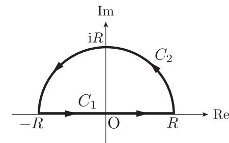
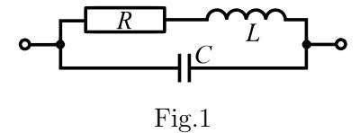

## Slot 1: 1.1 Calculus (40 minutes)

Answer the following questions. All constants and variables are real numbers. All functions are real functions. Omit the derivations and write only the answers.

(Q.1) Let y(x) be a function satisfying the differential equation

$$\frac{\mathrm{d}^2 y}{\mathrm{d}x^2} + 3\frac{\mathrm{d}y}{\mathrm{d}x} + 2y = f(x).$$

- (1) Obtain the solution for f(x) = 0. Use  $C_1$  and  $C_2$  for arbitrary constants.
- (2) Obtain the solution for  $f(x) = e^{2x}$ . e is the base of the natural logarithm.
- (Q.2) Let y(x) be a function satisfying the differential equation

$$\frac{\mathrm{d}y}{\mathrm{d}x} = \frac{x+y-1}{x+y+1}.$$

- (1) Changing variables as x + y = u, obtain the differential equation that x and u satisfy and y is not included.
- (2) Obtain the function f(u) that satisfies x = f(u) by solving the differential equation. Use C for an arbitrary constant.

(Q.3) Calculate the following indefinite integral and write down the expression that fills the blank space. a is a non-zero constant.

$$\int e^x \sin ax \, dx = \boxed{ (\sin ax - a \cos ax)}.$$

(Q.4) Consider an ellipse on a xy Cartesian coordinate system:

$$\frac{x^2}{a^2} + \frac{y^2}{b^2} = 1,$$

where a and b are non-zero positive constants.

- (1) Obtain the equation of the tangent line of the ellipse. The tangent point is expressed as  $(a\cos\theta, b\sin\theta)$  using a variable  $\theta$ .
- (2) Let the points where the tangent line intersects the x-axis and y-axis be A and B, respectively. Find the minimum length of the line segment AB.
- (Q.5) Consider the following multiple integral over the region D enclosed by the ellipse given in (Q.4):

$$\iint_{\mathcal{D}} (x^2 + y^2) \, \mathrm{d}x \mathrm{d}y.$$

(1) Obtain the Jacobian for the change of variables using r and  $\theta$ :

$$x = ar\cos\theta, \quad y = br\sin\theta.$$

(2) Calculate the multiple integral above.

## Slot 2: 2.1 Linear algebra (40 minutes)

Answer the following questions.

(Q.1) Consider a real square matrix A given by

$$A = \left(\begin{array}{cc} \alpha & \beta \\ 1 - \alpha & 1 - \beta \end{array}\right),$$

where  $0 < \alpha < 1$ ,  $0 < \beta < 1$ . Answer the following questions. Omit the derivations and write only the answers.

- (1) Obtain the eigenvalues  $\lambda_1$  and  $\lambda_2$  ( $\lambda_1 < \lambda_2$ ) of matrix A.
- (2) Obtain the eigenvectors  $\mathbf{x}_1$  and  $\mathbf{x}_2$  of matrix A.  $\mathbf{x}_1$  and  $\mathbf{x}_2$  correspond to  $\lambda_1$  and  $\lambda_2$ , respectively.
- (3) Obtain  $\lim_{n\to\infty} A^n$ , where n is a positive integer.
- (Q.2) Consider an  $n \times n$  real symmetric matrix B with the eigenvalues  $\mu_1, \mu_2, \ldots, \mu_n$  ( $\mu_1 < \mu_2 < \ldots < \mu_n$ ) and the corresponding eigenvectors  $\boldsymbol{v}_1, \boldsymbol{v}_2, \ldots, \boldsymbol{v}_n$ .
  - (1) Under the constraint of  $x \neq 0$ , obtain the minimum of  $\frac{x^{\top}Bx}{x^{\top}x}$ . Show the derivations in addition to the answers.
  - (2) Under the constraint of  $x \neq \mathbf{0}$  and  $\mathbf{x}^{\top}\mathbf{v}_{i} = 0$  ( $i = 1, 2, ..., m, 1 \leq m < n$ ), obtain the minimum of  $\frac{\mathbf{x}^{\top}B\mathbf{x}}{\mathbf{x}^{\top}\mathbf{x}}$ .

    Omit the derivations and write only the answers.

Note that n and m are positive integers,  $\boldsymbol{x}$  is an n-dimensional real vector, and  $\top$  is a transpose.

(Q.3) Consider a real square matrix C given by

$$C = \begin{pmatrix} c_{11} & c_{12} & c_{13} \\ c_{21} & c_{22} & c_{23} \\ c_{31} & c_{32} & c_{33} \end{pmatrix}.$$

Assume the eigenvalues of matrix C are  $\gamma_1$ ,  $\gamma_2$ , and  $\gamma_3$  ( $\gamma_1 < \gamma_2 < \gamma_3$ ). Answer the following questions.

(1) Express the following in terms of  $\gamma_1$ ,  $\gamma_2$ , and  $\gamma_3$ :

$$\sum_{1 \le i < j \le 3} (c_{ii}c_{jj} - c_{ij}c_{ji}).$$

Omit the derivations and write only the answer.

(2) Show that the following holds:

$$\det\left(\sum_{k=0}^{\infty} \frac{1}{k!} C^k\right) = e^{\gamma_1 + \gamma_2 + \gamma_3},$$

where e is the base of the natural logarithm,  $k! = k \cdot (k - 1) \cdots 2 \cdot 1$  is the factorial of k, and det is the determinant. Show the derivations.

## Slot 2: 2.2 Mechanics (40 minutes)

Consider four point masses with mass m which move along a straight line. As shown in Fig. 1, these masses are connected by massless springs with a natural length of l and a spring constant of k. Object A denotes the system composed of the two point masses and the spring on the left side, and Object B denotes the system composed of the two point masses and the spring on the right side.  $x_1, x_2, x_3$  and  $x_4$  denote the coordinates of each point mass, and  $v_1, v_2, v_3$  and  $v_4$  denote the velocities of each point mass. Suppose that  $x_1 < x_2, x_3 < x_4$  are satisfied at any time, and the coefficient of restitution is 1 (i.e., perfectly elastic collision) for the collisions between the masses, and friction can be neglected. Answer the following questions. You should write only the solutions on your answer sheet.

- (Q.1) At time t = 0,  $x_2 < x_3$ ,  $x_2 x_1 = x_4 x_3 = l$  are satisfied, and  $v_1 = V_{10} (> 0)$ ,  $v_2 = v_3 = v_4 = 0$ .
  - (1) Let us express the expansion and contraction of the spring by  $\Delta x \equiv x_2 x_1 l$ . Obtain the equation of motion for  $\Delta x$ , and find the characteristic frequency.
  - (2) The energy of Object A can be divided into the following three energies:  $C_A$ : the kinetic energy of the center of mass,  $R_A$ : the energy of the relative motion of the two point masses and  $S_A$ : the energy stored in the spring.  $C_A + R_A$  represents the total kinetic energy. Express  $C_A + R_A$  using m,  $v_1$  and  $v_2$ .
  - (3) Express  $C_A$ ,  $R_A$  using m,  $v_1$  and  $v_2$ , and express  $S_A$  using  $x_1$ ,  $x_2$ , l and k.

- (4) Express  $C_A$  and  $R_A$  at t = 0 using m and  $V_{10}$ . Find  $S_A$  at t = 0.
- (Q.2) Consider the first collision between Object A and Object B under the initial condition shown in (Q.1). At this moment,  $x_2 = x_3$ , and the right point mass of Object A and the left point mass of Object B collide with each other. Let  $V_2$  (> 0) and  $v_3 = 0$  be the velocities of these point masses just before the collision, and let  $V_2'$  and  $V_3'$  be the velocities of them just after the collision.
  - (1) Express  $V_2'$  and  $V_3'$  using  $V_2$ .
  - (2) Let  $C_{\rm B}$ ,  $R_{\rm B}$ ,  $S_{\rm B}$  be the energies of Object B defined in a similar manner as those of Object A. Obtain the ratio  $C_{\rm B}/(R_{\rm B}+S_{\rm B})$  just after the collision.
  - (3) Express  $v_1$  just before the collision using  $V_{10}$  and  $V_2$ .
  - (4) Express  $R_A$  just before the collision using m,  $V_{10}$  and  $V_2$ .
  - (5) Express the ratio  $C_{\rm A}/(R_{\rm A}+S_{\rm A})$  just after the collision using  $V_{10}$  and  $V_2$ .

## Slot 3: 3.1 Mathematical analysis (40 minutes)

The Fourier transform of a real function f(t) and its inverse Fourier transform are, respectively, defined as

$$F(\omega) = \mathcal{F}[f(t)] = \int_{-\infty}^{\infty} f(t) e^{-i\omega t} dt,$$
$$\mathcal{F}^{-1}[F(\omega)] = \frac{1}{2\pi} \int_{-\infty}^{\infty} F(\omega) e^{i\omega t} d\omega,$$

where t and  $\omega$  are real numbers, e is the base of the natural logarithm, and i is the imaginary unit. A real function g(t) is defined as  $g(t) = \begin{cases} \mathrm{e}^{-at}, & t \geq 0 \\ 0, & t < 0, \end{cases}$ 

where a is a positive real constant. Answer the following questions. Omit the derivations and write only the answers in (Q.1) and (Q.2). Show the derivations in addition to the answers in (Q.3) and (Q.4).

- (Q.1) Obtain the Fourier transform  $G(\omega)$  of g(t).
- (Q.2) A real function h(t) is defined as  $h(t) = \int_{-\infty}^{\infty} g(t+s)g(s)\mathrm{d}s$ , where s is a real number. Express the Fourier transform  $H(\omega)$  of h(t) in terms of  $G(\omega)$  and its complex conjugate  $\overline{G(\omega)}$ .
- (Q.3) Let z be a complex number. Consider the following contour integral along the integral path  $C = C_1 + C_2$  shown in Figure 1.

$$\oint_C \frac{e^{izt}}{z^2 + a^2} dz \quad (t \ge 0). \tag{1}$$

 $C_1$  is the line segment connecting -R and R, and  $C_2$  is the upper semicircle with radius R centered at the origin O, where R > a. Re z and Im z represent the real and imaginary part of z, respectively.

- (i) Obtain the pole in Im z > 0 and the residue at the pole of the integrand of Eq. (1).
- (ii) Calculate the integral

$$\int_{-\infty}^{\infty} \frac{e^{i\omega t}}{\omega^2 + a^2} d\omega,$$

by applying the residue theorem to Eq. (1). You may use the fact that the contribution of the integral along  $C_2$  vanishes as  $R \to \infty$ .

(Q.4) Obtain the inverse Fourier transform  $\mathcal{F}^{-1}[H(\omega)]$  of  $H(\omega)$  obtained in (Q.2), and sketch its graph as a function of t.

Figure 1: Integral path.

## Slot 3: 3.2 Probability and Statistics (40 minutes)

- (Q.1) Suppose that 0.1 % of the population has an infectious disease. A screening test for the disease gives a positive result for 80 % of those taking the test and being infected. However, the test incorrectly gives a positive result for 0.2 % of those taking the test and not being infected. If a randomly selected person from the population has tested positive, what is the probability of being infected? Choose the closest answer from the following choices. Omit the derivation and write only the answer.
  - (a) 0.2, (b) 0.3, (c) 0.4, (d) 0.5,
  - (e) 0.6, (f) 0.7, (g) 0.8, (h) 0.9.
- (Q.2) Let  $X_1, X_2, ..., X_n$  be independent and identically distributed random variables with the probability density function f(x) given by

 $f(x) = \begin{cases} \lambda e^{-\lambda x}, & x \ge 0, \\ 0, & x < 0, \end{cases}$ 

where e is the base of the natural logarithm and  $\lambda$  is a positive parameter. Answer the following questions. Regarding questions (1), (2), and (3), omit the derivations and write only the answers. Show the derivations in addition to the answers in (4) and (5).

- (1) Consider the expectation  $E[X_1]$  and variance  $V[X_1]$  of  $X_1$ . Obtain constants a, b, c, and d satisfying  $E[X_1] = a\lambda^b$  and  $V[X_1] = c\lambda^d$ .
- (2) Obtain the maximum likelihood estimator of  $\lambda$  based on the sample  $(X_1, X_2, \dots, X_n)$ .
- (3) Consider two random variables  $S_2 = X_1 + X_2$  and  $S_3 = X_1 + X_2 + X_3$ . Obtain the probability density functions of  $S_2$  and  $S_3$ , denoted as  $f_{S_2}(x)$  and  $f_{S_3}(x)$ , respectively.
- (4) Consider a sum of n random variables  $S_n = \sum_{k=1}^n X_k$ . Derive the probability density function of  $S_n$ , denoted as  $f_{S_n}(x)$ . You may use the following formula:

$$m! = \int_0^\infty t^m e^{-t} dt,$$

where m is a natural number, t is a real number, and  $m! = m \cdot (m-1) \cdots 2 \cdot 1$  represents the factorial of m.

(5) Show whether the maximum likelihood estimator obtained in (2) is the unbiased estimator or not.

## Slot 3: 3.3 Electromagnetism (40 minutes)

Answer the following questions. Use the vacuum permittivity  $\varepsilon_0$  and vacuum permeability  $\mu_0$  as necessary.  $\boldsymbol{E}$  and  $\boldsymbol{B}$  represent the electric field and magnetic field, respectively. Write only the solutions on your answer sheet.

- (Q.1) Express the following values using  $\rho$ , l, S, d and n.
  - (1) Electrical resistance R of a cylinder (cross-sectional area S, length l) made of a material with resistivity  $\rho$ .
  - (2) Capacitance C between parallel plates of area S separated by a small distance d.
  - (3) Self-inductance L of a long solenoid with cross-sectional area S, length l and number of turns per unit length n.
- (Q.2) When an AC voltage (angular frequency  $\omega$ ) is applied to both ends of the circuit shown in Fig.1, express the total impedance using R, L and C.

(Q.3) Faraday's law and Ampere's law in vacuum with charge and

current densities 0 are expressed as follows.

$$\nabla \times \mathbf{E} + \partial \mathbf{B} / \partial t = 0,$$
$$\nabla \times \mathbf{B} - \varepsilon_0 \mu_0 \partial \mathbf{E} / \partial t = 0.$$

Write the wave equation for E. You may use the vector formula  $\nabla \times (\nabla \times F) = \nabla (\nabla \cdot F) - \nabla^2 F$  if necessary.

(Q.4) When the solutions to the wave equation for E and B can be expressed as follows, find the relationship between  $\omega$  and k.

$$E(x,t) = e_1 E_0 \sin(k \cdot x - \omega t),$$
  

$$B(x,t) = e_2 B_0 \sin(k \cdot x - \omega t).$$

In addition, find the phase velocity  $v_p$  of this wave. Note that k is a real wavenumber vector, x is a coordinate vector,  $\omega$  is a frequency (real number) and  $e_1$  and  $e_2$  are unit vectors. Here, k,  $e_1$  and  $e_2$  are perpendicular to each other.

- (Q.5) Find the relationship between  $E_0$ ,  $B_0$ , and the phase velocity  $v_p$  obtained in the previous question.
- (Q.6) When the energy u of the electromagnetic field per unit volume can be expressed as follows, find the energy and the pointing vector averaged over a cycle.

$$u = \varepsilon_0 |\mathbf{E}|^2 / 2 + |\mathbf{B}|^2 / 2\mu_0.$$

(Q.7) When the average energy flux of the sunlight is 1.4 kW/m2, calculate the average energy density and the amplitudes of the electric field and magnetic field to one significant digit. Let  $\varepsilon_0 = 8.9 \times 10^{-12}$  F/m and  $\mu_0 = 1.3 \times 10^{-6}$  H/m.