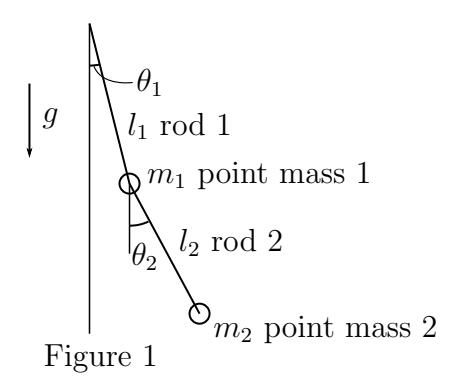
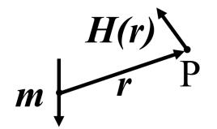

## Slot 1: 1.1 Calculus (40 minutes)

Answer the following questions. All constants and variables are real numbers. All funcions are real functions. Omit the derivations and write only the answers.

(Q.1) Let functions A(t), B(t), and C(t) satisfy the following differential equations.

$$\frac{\mathrm{d}A(t)}{\mathrm{d}t} = -k_1 A(t),$$

$$\frac{\mathrm{d}B(t)}{\mathrm{d}t} = k_1 A(t) - k_2 B(t),$$

$$\frac{\mathrm{d}C(t)}{\mathrm{d}t} = k_2 B(t).$$

Initial conditions are  $A(0) = A_0$ , B(0) = 0, and C(0) = 0. Here,  $A_0$ ,  $k_1$ , and  $k_2$  are positive constants.

- (1) Obtain A(t).
- (2) Obtain B(t) and C(t) when  $k_1 \neq k_2$ .
- (3) Obtain B(t) and C(t) when  $k_1 = k_2$ .

- (Q.2) Consider a plane P passing through the origin with a unit normal vector (a, b, c) on a xyz Cartesian coordination system.
  - (1) Obtain an expression for the plane P.
  - (2) Three points are defined as  $Q_1(\sqrt{2},0,0)$ ,  $Q_2(0,1,-1)$ , and  $Q_3(1,1,1)$ . Let the distance from  $Q_i$  (i=1,2,3) to the plane P be  $h_i$ . L is defined as  $L=h_1^2+h_2^2+h_3^2$ . Obtain an expression for L in terms of a, b, and c.
  - (3) Obtain an expression for the plane P and the value of L for the case in which L is minimized.
- (Q.3) Consider a region W surrounded by three curves  $y = \frac{1}{x^2 + 1}$ ,  $y = \frac{1}{2}x^2$ , and x = 0 for  $x \ge 0$  on a xy Cartesian coordination system. Obtain the volume of the object formed by the operation of rotating W once around the y-axis.
- (Q.4) Consider a trajectory of a point  $(x, y, z) = (\cos \theta, \sin \theta, \theta)$  in the range  $0 \le \theta \le 2\pi$  on a xyz Cartesian coordination system. Calculate the length of the trajectory.

## Slot 2: 2.1 Linear algebra (40 minutes)

(Q.1) Consider a matrix A and a vector  $\boldsymbol{b}$  given by

$$A = \begin{pmatrix} 0 & 1 & 0 \\ a & 0 & 1 \\ 1 - a & 0 & 0 \end{pmatrix}, \ \boldsymbol{b} = \begin{pmatrix} 1 \\ 0 \\ 0 \end{pmatrix},$$

where a is a real constant. Let  $x_n$  (n = 0, 1, 2, ...) be three dimensional real vectors. Answer the following questions. Omit the derivations and write only the answers.

- (1) Obtain the eigenvalues of A.
- (2) Suppose that the rank r of matrix A satisfies r < 3. Obtain a.
- (3) Obtain the set of vectors  $\mathbf{v}$  satisfying  $A\mathbf{v} = \mathbf{0}$ .
- (4) Consider a map  $\mathbf{x}_{n+1} = A\mathbf{x}_n$  (n = 0, 1, 2, ...). Obtain the condition of a for the existence of

$$\boldsymbol{x}^* = \lim_{n \to \infty} \boldsymbol{x}_n$$

for any  $x_0$ .

(5) Suppose that a satisfies the condition obtained in (4). Then, obtain  $\mathbf{x}^*$  for  $\mathbf{x}_0 = \mathbf{b}$ .

(Q.2) Consider the following three vectors:

$$u_1 = \begin{pmatrix} 1 \\ 3 \\ -2 \end{pmatrix}, u_2 = \begin{pmatrix} 1 \\ 1 \\ 0 \end{pmatrix}, u_3 = \begin{pmatrix} 1 \\ 0 \\ 1 \end{pmatrix}.$$

Answer the following questions.

- (1) Determine whether these vectors are linearly independent.
- (2) The equation that the set of points (x, y, z) described as a linear combination of these vectors obeys can be expressed as z = lx + my. Obtain l and m.

Omit the derivations and write only the answers.

(Q.3) The necessary and sufficient condition for three lines  $a_i x + b_i y + c_i = 0$  (i = 1, 2, 3) in the xy Cartesian coordinate system to intersect at a point or be parallel is

$$c_1 f_1 + c_2 f_2 + c_3 f_3 = 0,$$

where  $f_i$  (i = 1, 2, 3) are certain functions

$$f_i = f_i(a_1, a_2, a_3, b_1, b_2, b_3).$$

Answer the following questions about this proposition.

- (1) From the condition for three lines to intersect at a point, obtain the functions  $f_i$  (i = 1, 2, 3).
  - Omit the derivations and write only the answers.
- (2) Prove this proposition.

## Slot 2: 2.2 Mechanics (40 minutes)

Consider a system of a pendulum of point mass 2 of mass  $m_2$  and rod 2 of length  $l_2$ , connected at the end of a pendulum of point mass 1 of mass  $m_1$  and rod 1 of length  $l_1$  as shown in Figure 1. Assume the rods do not have mass. Gravitational acceleration g (> 0) is vertically downward, and the angles of rod 1 and rod 2 from this direction are  $\theta_1$  and  $\theta_2$ , respectively. Assume the deviation of  $\theta_1$  and  $\theta_2$  from 0 is sufficiently small and answer the questions to lowest order in powers of  $\theta_1$  and  $\theta_2$ .

- (Q.1) First, assume that  $\theta_1 = 0$  and does not vary.
  - (1) Write the first order equation of motion for  $\theta_2$ .
  - (2) Obtain the positive characteristic angular frequency of the equation of motion of (1).
  - (3) Write the order (in terms of  $\theta_2$ ) of the inertial force along rod 2 in the system moving with point mass 2.
  - (4) Obtain the magnitude of the tension F on point mass 2 from rod 2.
- (Q.2) Next, consider also the motion of point mass 1.
  - (1) Write the equation of motion for point mass 1 in the  $\theta_1$  direction using the tension F on rod 2.

- (2) Write the order (in terms of  $\theta_1$ ) of the acceleration of point mass 1 along rod 1 in the lab frame.
- (3) The equation of motion for point mass 2 has an additional force term  $(\simeq -m_2 l_1 d^2 \theta_1/dt^2)$  compared to that of (Q.1)(1). Explain briefly why this force appears.
- (4) Write the coupled first order equations of motion for  $(\theta_1, \theta_2)$  in the following form:

$$\frac{\mathrm{d}^2}{\mathrm{d}t^2} \begin{pmatrix} \theta_1 \\ \theta_2 \end{pmatrix} = - \begin{pmatrix} \kappa_{11} & \kappa_{12} \\ \kappa_{21} & \kappa_{22} \end{pmatrix} \begin{pmatrix} \theta_1 \\ \theta_2 \end{pmatrix}.$$

Assume the tension F on rod 2 is the same as (Q.1)(4) to lowest order in  $\theta_1$  and  $\theta_2$ .

(5) Let  $l_1 = 2a/3$ ,  $l_2 = a/2$  and  $m_1 = m_2$ . Obtain the two positive characteristic angular frequencies of the system, and the corresponding characteristic vector  $(\theta_1, \theta_2)$ . It is not necessary to normalize the characteristic vectors.

## Slot 3: 3.1 Mathematical analysis (40 minutes)

Let x, t, and  $\theta$  be real numbers and z be a complex number. Answer the following questions.

(Q.1) Let  $m, n \ge 1$  be integers and L be a real number. Calculate

$$\int_{-L}^{L} \sin\left(\frac{m\pi}{L}x\right) \sin\left(\frac{n\pi}{L}x\right) dx.$$

Omit the derivations and write only the answer.

- (Q.2) Consider the function  $f(x) = \sum_{n=1}^{\infty} a_n \sin\left(\frac{n\pi}{L}x\right)$ . Suppose that  $a_n$  is expressed as  $a_n = \int_0^L f(x)g_n(x) dx$ . Obtain  $g_n(x)$ . Omit the derivations and write only the answer.
- (Q.3) Suppose  $0 \le x \le 1$ . Consider the partial differential equation  $\frac{\partial^2 u}{\partial t^2} = \frac{\partial^2 u}{\partial x^2}$  for the two-variable function u(x,t) under the initial condition  $u(x,0) = x x^2$ ,  $\frac{\partial u(x,0)}{\partial t} = 0$  and the boundary condition u(0,t) = u(1,t) = 0. Suppose the solution of the partial differential equation is given by  $u(x,t) = \sum_{n=1}^{\infty} b_n X_n(x) T_n(t)$ . Obtain the coefficient  $b_n$ , and the functions  $X_n(x)$ , and  $T_n(t)$ . Omit the derivations and write only the answer.

(Q.4) Let k be an integer. Consider the Laurent expansion  $h(z,x) = \sum_{k=-\infty}^{\infty} J_k(x) z^k \text{ of the function}$ 

$$h(z,x) = \exp\left(\frac{x}{2}\left(z - \frac{1}{z}\right)\right).$$

(i) Show that the following relationship holds, <u>using the</u> residue theorem.

$$J_k(x) = \frac{1}{\pi} \int_0^{\pi} \cos(x \sin \theta - k\theta) d\theta \tag{1}$$

- (ii) Let a be a real constant. Obtain  $\frac{d}{d\theta}\sin(a\sin\theta)$ . Omit the derivations and write only the answer.
- (iii) Suppose  $x \neq 0$ . Express  $J_{k-1}(x) J_{k+1}(x)$  and  $J_{k-1}(x) + J_{k+1}(x)$  in terms of  $J_k(x)$  and  $\frac{\mathrm{d}J_k(x)}{\mathrm{d}x}$ . You may use equation (1). Omit the derivations and write only the answer.

## Slot 3: 3.2 Probability and Statistics (40 minutes)

(Q.1) Let  $X_1$  and  $X_2$  be random variables that are independent of each other and obey a continuous uniform distribution over the interval [0, 1]. Answer the following questions.

Omit the derivations and write only the answers.

- (1) Obtain the expectation  $E[X_1]$  and the variance  $V[X_1]$  of  $X_1$ .
- (2) Let X be the maximum value of  $X_1, X_2$ . Obtain the probability  $\Pr\left(X \geq \frac{1}{3}\right)$ .
- (Q.2) Let  $Y_1$  be a random variable that obeys a continuous uniform distribution over the interval [0,1]. Let  $Y_2$  be a random variable that obeys the following conditional probability density function conditioned on  $Y_1$  as

$$f_{Y_2|Y_1}(y_2|y_1) = \frac{1}{2}e^{-|y_2 - y_1|} \ (-\infty < y_2 < \infty).$$

Here,  $|y_2 - y_1|$  denotes the absolute value of  $y_2 - y_1$ , and e denotes the base of the natural logarithm. Answer the following questions. Omit the derivations and write only the answers.

(1) Obtain the marginal probability density function  $f_{Y_2}(y_2)$  of  $Y_2$ .

- (2) Obtain the probability  $Pr(Y_2 \ge 0)$ .
- (Q.3) Let  $\{Z_1, Z_2, \ldots, Z_n\}$  be a random sample of size n from a continuous uniform distribution over the interval  $[0, \theta]$ . Here,  $\theta$  is a positive parameter. Let  $\hat{\theta} = \frac{2}{n} \sum_{i=1}^{n} Z_i$  be an estimator of  $\theta$ . Answer the following questions.

  Write the derivations in addition to the answers.
  - (1) Show that  $\hat{\theta}$  is an unbiased estimator of  $\theta$ .
  - (2) Obtain the variance  $V[\hat{\theta}]$  of  $\hat{\theta}$ .
  - (3) Obtain the probability density function of  $\hat{\theta}$  for n=2.

## Slot 3: 3.3 Electromagnetism (40 minutes)

Answer the following questions. In all the problems, assume a vacuum environment and use the vacuum permeability  $\mu_0$  as necessary.

(Q.1) As shown in Figure 1, let  $\boldsymbol{H}(\boldsymbol{r})$  be the magnetic field due to the magnetic moment  $\boldsymbol{m}$  at point P (at position  $\boldsymbol{r}$ ).  $\boldsymbol{H}(\boldsymbol{r})$  is written as

$$\boldsymbol{H}(\boldsymbol{r}) = \frac{1}{4\pi} \left\{ \frac{3(\boldsymbol{m} \cdot \boldsymbol{r})\boldsymbol{r}}{|\boldsymbol{r}|^5} - \frac{\boldsymbol{m}}{|\boldsymbol{r}|^3} \right\}.$$

Figure 1

- (1) Express the relationship between the magnetic flux density B(r) and H(r) at point P.
- (2) Find the magnitude of the magnetic flux density when the angle between  $\boldsymbol{m}$  and  $\boldsymbol{r}$  is  $\pi/2$ .
- (3) Find the magnitude of the magnetic flux density when the angle between m and r is  $\pi$ .
- (4) Sketch the magnetic field created by the magnetic moment m using several magnetic field lines with the directions.
- (Q.2) As shown in Figure 2, let  $d\boldsymbol{H}$  be the magnetic field at displacement  $\boldsymbol{r}$  generated by current I flowing through the line element  $d\boldsymbol{s}$ . Using the Biot–Savart law,  $d\boldsymbol{H}$  is written as

$$d\boldsymbol{H} = \frac{1}{4\pi} \frac{Id\boldsymbol{s} \times \boldsymbol{r}}{|\boldsymbol{r}|^3}.$$

- (1) If  $d\mathbf{s}$  is a part of a circular ring of radius a, find the axial component of the magnetic field created by the current I flowing through  $d\mathbf{s}$  at a point of height z on the central axis.
- (2) Find the magnetic field created by a circular current I of radius a at a point of height z on the central axis. Also, find the magnetic field at z=0.
- (3) Find the magnitude of the magnetic flux density on the axis when  $z \gg a$ . If this value is equal to the magnitude of the magnetic flux density obtained in (Q.1)(3), express the magnitude of the magnetic moment  $\boldsymbol{m}$  using a and I.

Figure 2

(Q.3) Assume that the earth is a sphere of radius r with a southward magnetic moment  $\mathbf{m}$  at its center. Let  $|\mathbf{m}| = 7.8 \times 10^{22} \,\mathrm{Am^2}$  and  $r = 6400 \,\mathrm{km}$ . Given a circular current of radius 1 m at the equator, find the current required to cancel the earth's magnetic field at the center of the circle to two significant digits. Also, sketch the relative position of the earth and the circular current. Also, indicate the direction of the circular current with an arrow.