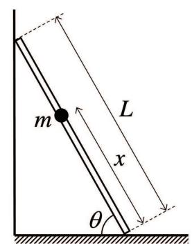
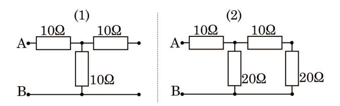
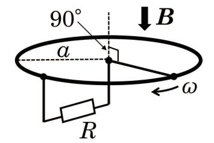

## Slot 1: 1.1 Calculus (40 minutes)

Answer the following questions. All constants and variables are real numbers. All functions are real functions. e is the base of the natural logarithm. The first and second derivatives of a function g(x) are represented by  $\frac{dg(x)}{dx} = g'(x)$  and  $\frac{d^2g(x)}{dx^2} = g''(x)$ , respectively.

Omit the derivations and write only the answers.

- (Q.1) Obtain the solutions of the following differential equations of a function f(x) under given initial conditions.
  - (1) f''(x) 8f'(x) + 16f(x) = 0, f(0) = 1, f'(0) = 3.
  - (2) f''(x) + 4f'(x) + 13f(x) = 0, f(0) = 1, f'(0) = 0.
  - (3)  $f''(x) + 4f'(x) + 13f(x) = 40\sin x, f(0) = 0, f'(0) = 4.$
- (Q.2) A curved surface C is defined as  $z = xe^{-x^2-y^2}$  in an xyz Cartesian coordinate system. Answer the following questions.
  - (1) z takes the maximum value  $z_0$  at the point  $A(x_0, y_0, z_0)$  on the curved surface C. Obtain the values of  $x_0, y_0$ , and  $z_0$ .
  - (2) Consider the point  $B(1,1,z_1)$  on the curved surface C. Obtain the value of  $z_1$  and the equation of the tangent plane at the point B.

- (Q.3) In an xy Cartesian coordinate system, a region R is defined as  $R = \{(x,y)|x^2+y^2 \leq 1, x \geq 0, y \geq 0\}$ . Answer the following questions.
  - (1) Obtain  $\iint_R x^2 y^2 dx dy$ .
  - (2) Obtain  $\iint_R (x+y)^2 dxdy$ .
- (Q.4) Hermite polynomials  $H_n(x)$  are defined as

 $H_n(x) = (-1)^n e^{x^2} \frac{\mathrm{d}^n}{\mathrm{d}x^n} \left( e^{-x^2} \right)$ . Here, n is a non-negative integer and  $H_0(x) = 1$ . These polynomials satisfy the following differential equations:  $H_n''(x) - 2xH_n'(x) + 2nH_n(x) = 0$ . Also, the following relations hold true:

 $\int_{-\infty}^{\infty} H_m(x)H_n(x)e^{-x^2}dx = \sqrt{\pi}2^n n! \delta_{m,n}, \text{ where } m \text{ is a non-negative integer, and } \delta_{m,n} \text{ is the Kronecker delta, which is 1}$  for m=n and 0 otherwise. n! represents the factorial of n, and let 0!=1. Answer the following questions.

- (1) Express  $H_1(x)$  as a polynomial of x.
- (2) By differentiating  $H_n(x)$  with respect to x, express  $H_{n+1}(x)$  in terms of x,  $H_n(x)$ , and  $H'_n(x)$ .
- (3) Express  $H'_n(x)$  in terms of n and  $H_{n-1}(x)$  for  $n \ge 1$ .
- (4) Express  $H_{n+1}(x)$  in terms of x, n,  $H_n(x)$ , and  $H_{n-1}(x)$  for n > 1.
- (5) Calculate  $\int_{-\infty}^{\infty} x H_m(x) H_n(x) e^{-x^2} dx$  for  $n \ge 1$ .

#### Slot 2: 2.1 Linear algebra (40 minutes)

For a real column vector  $\boldsymbol{a}$ , let  $\|\boldsymbol{a}\| = \sqrt{\boldsymbol{a}^{\top} \boldsymbol{a}}$ , where  $\top$  indicates the transpose. I is an identity matrix.

- (Q.1) Assume that the column vectors of an  $m \times n$  real matrix A are linearly independent.  $\boldsymbol{b}$  is an m-dimensional real column vector, and  $\boldsymbol{x}$  is an n-dimensional real column vector. Answer the following questions. Omit the derivations and write only the answers.
  - (1) Express the relationship between m and n using an inequality.
  - (2) Let  $\hat{\boldsymbol{x}}$  be  $\boldsymbol{x}$  that minimizes  $||A\boldsymbol{x} \boldsymbol{b}||^2$  for given A and  $\boldsymbol{b}$ . Express  $\hat{\boldsymbol{x}}$  in terms of A and  $\boldsymbol{b}$ .
  - (3) A can be decomposed as A = QR, where Q is an  $m \times n$  real matrix that satisfies  $Q^{T}Q = I$ , and R is an  $n \times n$  upper triangular matrix. Obtain one Q for A given by

$$A = \begin{pmatrix} 1 & 0 & -1 \\ \sqrt{2} & \sqrt{2} & \sqrt{2} \\ 0 & 0 & 1 \\ -1 & 0 & 1 \end{pmatrix}.$$

(4)  $||A\hat{\boldsymbol{x}} - \boldsymbol{b}||^2$  can be expressed as

$$||A\hat{\boldsymbol{x}} - \boldsymbol{b}||^2 = ||\underline{\mathbf{i}}||^2 - ||\underline{\mathbf{ii}}||^2.$$

Find expressions that fill the blanks i and ii in terms of Q and b.

- (Q.2) Consider three points  $(2, 1, \sqrt{2})$ ,  $(2, \sqrt{2}, 2)$ , and (1, 0, 1) in an xyz Cartesian coordinate system. Answer the following questions. Omit the derivations and write only the answers.
  - (1) Express the equation of the plane P passing through the three points in terms of x, y, and z.
  - (2) Let  $\mathbf{p} = (p_1, p_2, p_3)^{\top}$  be an arbitrary point on the plane P, and let R be a matrix representing a rotation about the origin. Find R such that the equation of the plane P' obtained by transforming the plane P as  $R\mathbf{p}$  is z = 1.
- (Q.3) Consider two matrices A and B given by

$$A = \begin{pmatrix} -2 & -2 \\ -1 & 0 \\ 0 & 1 \\ 3 & 1 \end{pmatrix}, \quad B = \begin{pmatrix} 2 & 0 \\ 0 & -1 \\ 0 & 1 \\ -2 & 0 \end{pmatrix}.$$

Let  $\boldsymbol{x}$  and  $\boldsymbol{y}$  be two-dimensional real column vectors. Answer the following questions. Regarding questions (1) and (2), omit the derivations and write only the answers. Regarding question (3), show the derivation in addition to the answer.

- (1) Obtain  $A^{\top}A$ .
- (2) Under the constraint of  $\|\boldsymbol{x}\| = 1$ , obtain the maximum of  $\|A\boldsymbol{x}\|^2$ .
- (3) Under the constraints of  $||A\boldsymbol{x}|| = 1$  and  $||B\boldsymbol{y}|| = 1$ , obtain the maximum of  $(A\boldsymbol{x})^{\top}(B\boldsymbol{y})$ .

## Slot 2: 2.2 Mechanics (40 minutes)

Answer the following questions. Let the gravitational acceleration be g > 0 except for Question 1.

- (Q.1) Answer how many seconds it takes for a point mass thrown vertically upward at an initial velocity of 8 m/s to pass a position 4 m below its initial position. Let the gravitational acceleration be  $10~\rm m/s^2$ .
- (Q.2) A point mass of mass m is moving under a force f. Write the equation of motion for this point mass in a coordinate system translationally moving at an acceleration of a. Let the position of the point mass in this coordinate system be r and the time be t.
- (Q.3) Point mass 1 of mass  $m_1$  and Point mass 2 of mass  $m_2$  are connected by a massless spring of spring constant k and placed on a frictionless horizontal plane.
  - (1) Write the equations of motion for each of Point masses 1 and 2 after they were pulled to both sides and gently released. The displacements of Point masses 1 and 2 from the positions before being pulled, with the direction from Point mass 1 to 2 taken as positive, are denoted as  $x_1$  and  $x_2$ , respectively. Let the time be t.
  - (2) Answer the angular frequency of the oscillation in (1).
- (Q.4) A point mass is placed on a horizontal plate. This plate starts a simple harmonic motion in the vertical direction with an angular frequency  $\omega$  and a displacement amplitude A, with the initial position being the center of the oscillation. At the start of the oscillation, the plate and the point mass have the same upward velocity.

- (1) Answer the condition under which the point mass does not leave the plate.
- (2) Under the condition where the point mass leaves the plate, answer the distance of the plate from the center of the oscillation when the point mass leaves.
- (Q.5) Consider a simple pendulum with a point mass of mass m at the end of a massless string of length L. Let the angle of inclination of the string from the vertically downward direction be  $\theta$ , and the velocity at the lowest point be V.
  - (1) Answer the tension of the string using L, m, V,  $\theta$ , and g.
  - (2) Find the condition for V such that the string does not loosen even at  $\theta = 180^{\circ}$ .
- (Q.6) As shown in the figure below, a massless straight ladder of length L stands between a frictionless vertical wall and a rough horizontal floor at an angle  $\theta$  to the horizontal direction. The static friction coefficient between the ladder and the floor is  $\mu$ . When a point mass of mass m is at a distance of x from the bottom of the ladder, find the range of x where the ladder does not slide down.

## Slot 3: 3.1 Mathematical analysis (40 minutes)

Let n and m be non-negative integers, a be a positive real number, and t and  $\tau$  be real numbers. The Laplace transform of a real function f(t) is defined as

$$F(s) = \int_0^\infty f(t) e^{-st} dt,$$

where e is the base of the natural logarithm. s is a complex number, which satisfies a condition such that the above integral converges. Also, a unit step function u(t) is defined as

$$u(t) = \begin{cases} 1, & t \ge 0 \\ 0, & t < 0. \end{cases}$$

Answer the following questions.

- (Q.1) Obtain the Laplace transforms F(s) of the following functions f(t) and the conditions on s for F(s) to exist. Omit the derivations and write only the answers.
  - (1) f(t) = u(t-a)
  - (2)  $f(t) = e^{at} \cdot u(t)$
  - (3)  $f(t) = \sin t \cdot u(t)$
  - $(4) f(t) = t^n \cdot u(t)$

(Q.2) Let g(t) be a real function defined for  $t \geq 0$ . When its Laplace transform is given as

$$G(s) = \left(\frac{1 - e^{-s}}{s}\right)^2,$$

obtain g(t) and show its schematic graph. Omit the derivation and write only the answer.

- (Q.3) Answer the following questions.

  Omit the derivations and write only the answers.
  - (1) When a real function f(t) and its derivative  $\frac{\mathrm{d}}{\mathrm{d}t}f(t)$  are defined for  $t \geq 0$ , express the Laplace transform of  $\frac{\mathrm{d}}{\mathrm{d}t}f(t)$  in terms of s, F(s), and f(0), where  $\lim_{t \to \infty} f(t)\mathrm{e}^{-st} = 0$ .
  - (2) Let f(t) be a real function defined for  $t \geq 0$  that satisfies the following equation and initial condition:

$$\frac{d}{dt}f(t) - \int_0^t f(t-\tau)\cos\tau \,d\tau = -\sin t - e^{-t}, \quad f(0) = 2.$$

- (i) Obtain F(s) by applying the Laplace transform to both sides of the equation.
- (ii) Obtain f(t).
- (Q.4) Obtain the Laplace transform of the following f(t). Show the derivation in addition to the answer.

$$f(t) = \begin{cases} 1, & 2ma \le t < (2m+1)a \\ -1, & (2m+1)a \le t < 2(m+1)a, \end{cases}$$
$$(m = 0, 1, 2, 3, \dots).$$

## Slot 3: 3.2 Probability and Statistics (40 minutes)

- (Q.1) Let X be a random variable obeying the normal distribution of mean 0 and variance 1. Also, let the conditional probability density function  $f_{Y|X}(y|x)$  of a random variable Y given X = x be the normal distribution of mean ax and variance  $\sigma^2$ , where a is a real number. Answer the following questions. Omit the derivations and write only the answers.
  - (1) Obtain the joint probability density function  $f_{X,Y}(x,y)$  of X and Y.
  - (2) Obtain the probability density function  $f_Y(y)$  of Y.
  - (3) Obtain the conditional probability density function  $f_{X|Y}(x|y)$  of X given Y = y.
- (Q.2) Let  $X_1, X_2, \ldots, X_n$  be n random variables that are independent and identically distributed and obey the normal distribution of mean 0 and variance 1. Let d and u be real numbers, and let c and  $\alpha$  be positive real numbers. Answer the following questions. Regarding questions (1), (2), (3), and (5), omit the derivations and write only the answers. Regarding the question (4), show the derivation in addition to the answer.

- (1) Obtain the probability density function  $f_Y(y)$  of a random variable  $Y = cX_1 + d$ .
- (2) Obtain the probability density function  $f_Z(z)$  of a random variable  $Z = (X_1)^2$ .
- (3) Obtain the expectation E[Z], the variance V[Z], and the moment-generating function  $M_Z(t) = E[e^{tZ}]$  of Z. Here, t is a real number, which satisfies  $t < \frac{1}{2}$ . You may use the formula  $\Gamma\left(\frac{1}{2}\right) = \sqrt{\pi}$ , where  $\Gamma(\alpha) = \int_0^\infty u^{\alpha-1} e^{-u} du$  is the Gamma function, and e denotes the base of the natural logarithm.
- (4) Obtain the probability density function  $f_S(s)$  of a random variable  $S = \sum_{i=1}^n (X_i)^2$  by assuming that  $f_S(s)$  is the Gamma distribution  $g_{k,\beta}(s) = \frac{\beta^k}{\Gamma(k)} s^{k-1} \mathrm{e}^{-\beta s} \ (s \ge 0)$  and finding the positive constants k and  $\beta$ .
- (5) Let  $W_1, W_2, \ldots, W_n$  be a random sample from the normal distribution of mean  $\mu$  and variance  $\sigma^2$ . Explain the method to calculate 95% confidence interval of the variance  $\sigma^2$  from the sample  $(W_1, W_2, \ldots, W_n)$  when the mean  $\mu$  is known.

# Slot 3: 3.3 Electromagnetism (40 minutes)

Answer the following questions.

(Q.1) Find the combined resistance between A and B for each of the circuits (1) and (2) shown below.

- (Q.2) Answer the following questions for a charged particle of mass m and charge q moving at a velocity  $\boldsymbol{v}$  in a uniform electric field  $\boldsymbol{E}$  and a magnetic flux density  $\boldsymbol{B}$ .
  - (1) Find the force on the charged particle.
  - (2) When the electric field and magnetic flux density can be written as  $(0, 0, E_z)$  and  $(0, 0, B_z)$  in an xyz cartesian coordinate system, respectively, write the equations of motion of the charged particle for each of x, y, z components. Let the velocity of the charged particle be  $(v_x, v_y, v_z)$  and the time be t.

(Q.3)

(1) When a current I flows in an infinitely long straight, and negligibly thin wire, find the strength of the magnetic field

 $\boldsymbol{H}$  at a distance r from the wire. Also, show the direction of the current and the direction of the magnetic field using a diagram.

(2) When a uniform current I flows in an infinitely long straight wire whose cross section is a circle of radius a, find the strength of the magnetic field  $\mathbf{H}$  at a distance r from the center of the wire.

(Q.4)

- (1) Find the magnitude of the induced electromotive force produced in a closed circuit when the magnetic flux across the circuit changes from  $\phi_1$  to  $\phi_2$  during an infinitesimal time dt.
- (2) Under a uniform magnetic flux density  $\boldsymbol{B}$ , a conducting ring of radius a and a resistor with resistance R are connected as shown in the figure below. The conducting rod is contacting the center of the ring and the ring. Find the current flowing through the resistor when the rod rotates with an angular velocity  $\omega$  about the center of the ring. Assume that the magnetic flux density  $\boldsymbol{B}$  and the surface on which the ring is placed are orthogonal.

