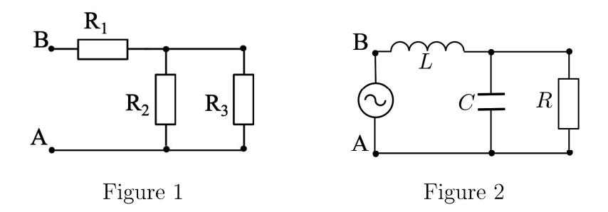
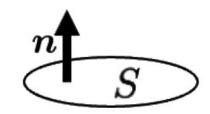
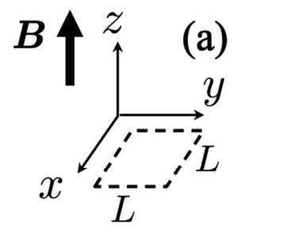
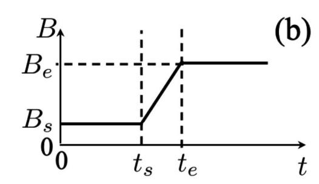

## Problem No. 1 (Calculus)

Answer the following questions. e is the base of the natural logarithm and i is the imaginary unit.

Omit the derivations and write only the answers.

(Q.1) Define the real function f(x) as follows:

$$f(x) = \int_0^x \mathrm{d}t \,\mathrm{e}^{-t^2}.$$

- (1) Obtain the derivative of f(x).
- (2) Obtain the Taylor expansion of f(x) around x = 0 up to the third order.
- (Q.2) Two real functions x(t) and y(t) satisfy the following coupled differential equations:

$$\frac{\mathrm{d}x}{\mathrm{d}t} = -\nu x - y + A\cos at,$$
$$\frac{\mathrm{d}y}{\mathrm{d}t} = -\nu y + x + A\sin at,$$

where A, a, and  $\nu$  ( $\nu > 0$ ) are real constants.

- (1) Let z(t) = x(t) + iy(t). Obtain the differential equation for z(t).
- (2) Let A = 0. Obtain the general solution x(t) and y(t) of the coupled differential equations.

- (3) Let A > 0. x(t) asymptotically approaches  $x_1(t) = B\cos(bt + \phi)$  as  $t \to \infty$  regardless of the initial condition. Here, B (B > 0), b, and  $\phi$  are real constants. Obtain B, b, and  $\phi$ .
- (Q.3) Define the real function f(x) as follows:

$$f(x) = xe^{-x}.$$

- (1) Obtain all the extrema of f(x) and the corresponding values of x.
- (2) In an xy Cartesian coordinate system, obtain the area of the region defined by  $0 \le y \le f(x)$  and x > 0.
- (3) In an xyz Cartesian coordinate system, obtain the volume of the solid formed by rotating the xy-plane region defined in (2) around the x-axis.
- (4) The surface of the solid defined in (3) can be expressed in terms of the real function

$$g(x, y, z) = y^2 + z^2 - x^2 e^{-2x},$$

as g(x, y, z) = 0. Obtain the gradient vector of g(x, y, z).

(5) Obtain the coordinates (x, y, z) where h(x, y, z) = xyz is maximized on the surface of the solid defined in (3) in the x > 0 region. In addition, obtain the maximum.

## Problem No. 2.1 (Linear algebra)

The transpose of a matrix or a vector is denoted by the superscript  $\top$ . The exponential of a square matrix J is defined as

$$e^J = \sum_{k=0}^{\infty} \frac{1}{k!} J^k.$$

Answer the following questions.

(Q.1) Consider the following real matrix A and real vectors  $\boldsymbol{b}$  and  $\boldsymbol{c}$ :

$$A = \begin{pmatrix} 2 & -1 & -1 \\ -1 & 2 & -1 \\ -1 & -1 & 2 \end{pmatrix}, \quad \boldsymbol{b} = \begin{pmatrix} 1 \\ 1 \\ \beta \end{pmatrix}, \quad \boldsymbol{c} = \begin{pmatrix} 3 \\ 2 \\ 1 \end{pmatrix},$$

where  $\beta$  is a constant.

Omit the derivations and write only the answers.

- (1) Obtain the eigenvalues  $\lambda_1 \leq \lambda_2 \leq \lambda_3$  of A.
- (2) Obtain the matrix P that satisfies

$$P^{\top}AP = \begin{pmatrix} \lambda_1 & 0 & 0 \\ 0 & \lambda_2 & 0 \\ 0 & 0 & \lambda_3 \end{pmatrix}.$$

- (3) Suppose that the equation  $A\mathbf{x} = \mathbf{b}$  for the variable  $\mathbf{x} \in \mathbb{R}^3$  has a solution. Obtain the value of  $\beta$ . In addition, obtain all the solutions of the equation.
- (4) Obtain  $\lim_{t\to\infty} e^{-At} \boldsymbol{c}$ , where t is a real number.

- (Q.2) Let B be an  $n \times n$  real asymmetric matrix.
  - (1) Show that the eigenvalues of B and  $B^{\top}$  are the same. You may use the fact that the determinants of a square matrix and its transposed matrix are the same.
  - (2) Let  $\lambda_i$  (i = 1, ..., n) be the eigenvalues of B. Let  $\boldsymbol{u}_i$  and  $\boldsymbol{v}_i$  be the eigenvectors of B and  $B^{\top}$  corresponding to the eigenvalue  $\lambda_i$ , respectively. Namely,

$$B\boldsymbol{u}_i = \lambda_i \boldsymbol{u}_i,$$
$$B^{\top} \boldsymbol{v}_i = \lambda_i \boldsymbol{v}_i$$

hold true. Show that  $\boldsymbol{v}_i^{\top} \boldsymbol{u}_i = 0$  for  $\lambda_i \neq \lambda_j$ .

## Problem No. 2.2 (Probability and Statistics)

Answer the following questions. e is the base of the natural logarithm, and i is the imaginary unit.

Omit the derivations and write only the answers.

- (Q.1) Let X and Y be random variables with the means  $\overline{X} = 1$ ,  $\overline{Y} = 2$ , the variances  $s_X = 1$ ,  $s_Y = 2$ , respectively, and the covariance  $s_{XY} = -1$ . Random variables U and V are defined by U = X + 3 and V = X + Y.
  - (1) Obtain the means  $\overline{U}$ ,  $\overline{V}$  of U, V.
  - (2) Obtain the variances  $s_U$ ,  $s_V$  of U, V.
  - (3) Obtain the covariance  $s_{UV}$  between U and V.
- (Q.2) Let X be a random variable obeying the standard Cauchy distribution:

$$p(x) = \frac{1}{\pi (1 + x^2)}.$$

Answer the following questions.

- (1) Obtain the cumulative distribution function F(x) of the standard Cauchy distribution.
- (2) Let U be a random variable obeying the uniform distribution on the interval [0,1]. Obtain the probability  $\Pr(U \leq F(x))$ , where F(x) is the cumulative distribution function in (1).

- (3) For U defined in (2), obtain the real function g(U) that satisfies X = g(U).
- (4) Obtain the characteristic function of the standard Cauchy distribution:  $\psi(t) = \int_{-\infty}^{\infty} e^{itx} p(x) dx$ , where t is a real number.
- (5) Let  $X_1, X_2, ..., X_n$  be n random variables that are independent and identically distributed and obey the standard Cauchy distribution. A random variable Z is defined by  $Z = X_1 + X_2 + ... + X_n$ . Obtain the probability density function of Z.
- (Q.3) Let  $(x_1, y_1), (x_2, y_2), \ldots, (x_N, y_N)$  be N sample pairs of random variables X and Y. Define the following statistics on the sample pairs:

$$\overline{x} = \frac{1}{N} \sum_{i=1}^{N} x_i, \quad \overline{y} = \frac{1}{N} \sum_{i=1}^{N} y_i,$$

$$\sigma_{xx} = \frac{1}{N} \sum_{i=1}^{N} x_i x_i, \quad \sigma_{xy} = \frac{1}{N} \sum_{i=1}^{N} x_i y_i.$$

The regression line  $Y = A_0 + A_1 X$  is obtained by minimizing the following function l:

$$l(A_0, A_1) = \sum_{i=1}^{N} (y_i - A_0 - A_1 x_i)^2,$$

which is assumed to be minimum at  $A_0 = a_0$  and  $A_1 = a_1$ . Express  $a_0$  and  $a_1$  in terms of  $\overline{x}$ ,  $\overline{y}$ ,  $\sigma_{xx}$ , and  $\sigma_{xy}$ . In addition, show the condition under which both  $a_0$  and  $a_1$  are uniquely determined.

### Problem No. 2.3 (Mechanics)

Answer the following questions. Let the gravitational acceleration be q > 0, constant). Write only the answers.

- (Q.1) A liner molecule ABA is composed of Atoms A and B. Atom B is located between two Atoms A. Consider Molecule ABA as a system composed of three point masses connected by two massless springs of spring constant k. The masses of Atoms A and B are m and M, respectively. The atoms move along a common line. Ignore the gravity.
  - (1) Write the equations of motion for the three atoms. The displacements of Atoms A, B, A from the natural lengths are defined as x, y, and z, respectively, with the positive direction from one Atom A to the other Atom A.
  - (2) Introduce  $Q_1 = x + z$  and  $Q_2 = x z$ . Answer the angular frequencies  $\omega_1$  and  $\omega_2$  of their oscillation. Let the center of the gravity of Molecule ABA do not move.
- (Q.2) Consider a point mass thrown at an elevation angle  $\theta$  with initial velocity  $v \neq 0$ . x axis is taken in the positive direction of the horizontal component of the initial velocity. y axis is taken in the

vertical upward direction. The origin is the initial position of the point mass.

- (1) Answer the vertical position y of the point mass at x = X (> 0), using X, g,  $\theta$ , and v.
- (2) Answer the range of the vertical position y where the point mass cannot reach at x = X (> 0) for any angles  $\theta$ , using X, g, and v.
- (Q.3) A uniform-density rigid sphere of mass m and radius r is at rest on a frictionless horizonal plate. We want to roll the sphere without slipping by hitting horizontally with a stick as shown in the figure below. Answer the vertical distance h from the center of the sphere to hit using m, r, and the moment of inertia I of the rigid sphere.

(Q.4) Suppose the Earth is a rigid sphere that rotates eastward around the axis passing through the south pole and the north pole at a constant angular velocity  $\omega$ . Let (x, y, z) be the coordinate system fixed to the Earth's surface with the origin at Point P on the northern hemisphere at latitude  $\theta$  ( $0 < \theta < \frac{\pi}{2}$ ). Positive direction of z axis is defined in the direction from the Earth's center to Point P, and positive directions of x axis and y axis are defined towards the south and east, respectively, on the tangential plane at Point P. A point mass of mass m is thrown from Point P to the positive direction of z axis at initial velocity v.

- (1) Answer the x, y, and z components of the Earth's angular velocity vector  $\boldsymbol{\omega}$  in the coordinate system (x, y, z).
- (2) The equation of motion for the point mass in the coordinate system (x, y, z) is expressed as follows using position vector  $\mathbf{r}$ , its first derivative with respect to time  $\dot{\mathbf{r}}$ , and its second derivative  $\ddot{\mathbf{r}}$ :

$$m\ddot{\boldsymbol{r}} = \boldsymbol{F} + 2m\dot{\boldsymbol{r}} \times \boldsymbol{\omega}$$

$$\mathbf{F} = (0, 0, -mg)$$

Write the acceleration for the point mass in the y direction at the time t elapsed after throwing the point mass, using, g, t, v,  $\omega$ ,  $\theta$ . Ignore the terms of order  $\omega^2$  or higher.

## Problem No. 2.4 (Electromagnetism)

Answer the following questions, assuming vacuum environment. Except for Q.5(2), write only the answers.

- (Q.1) In the below,  $\varepsilon_0$  and  $\mu_0$  are dielectric constant and permeability, respectively, in vacuum.
  - (1) Write the light speed, using  $\varepsilon_0$  and  $\mu_0$ .
  - (2) Two conducting wires are placed in parallel at a distance r. The length of the wires is infinite. Current I is flowing in the same direction in each wire. Write the magnitude and direction of the force acting on the wire per unit length.
- (Q.2) Answer the questions on the electric circuit shown in Figure 1. The  $R_1$ ,  $R_2$ , and  $R_3$  represent electric resistors, whose resistance values are  $r_1$ ,  $r_2$ , and  $r_3$ , respectively.
  - (1) Write the combined resistance value between A and B, using  $r_1, r_2, r_3$ .
  - (2) A constant voltage V is applied between A and B. Write the current flowing in  $R_3$ , and write the electric power consumed in  $R_2$ . The answers should use V,  $r_1$ ,  $r_2$ ,  $r_3$ .
- (Q.3) Answer the questions on the electric circuit shown in Figure 2. An AC voltage is applied with an amplitude  $\tilde{V}$  and an angular frequency

- $\omega$ . Here, L is the inductance of the coil, C is the capacitance of the capacitor, R is the resistance value of the resistor. Use j as the imaginary unit.
- (1) Write the combined impedance between A and B, using  $\omega$ , L, C, R.
- (2) Write the ratio  $\tilde{I}_C/\tilde{I}_R$ , where  $\tilde{I}_C$  is the amplitude of the current flowing in the capacitor and  $\tilde{I}_R$  is the amplitude of the current flowing in the resistor.
- (3) We remove the capacitor from the circuit, namely we handle a circuit without the capacitor. We express the voltage variation between A and B as  $V = \tilde{V}e^{j\omega t}$ . Write the current flowing in the coil, using  $\omega$ , L, R, V. Write also the effective electric power consumed in the resistor, using  $\omega$ , L, R,  $\tilde{V}$ . (The effective electric power is the time-averaged electric power.)
- (Q.4) There is a closed circuit shown in Figure 3. The circuit is formed by one turn loop of a conducting wire and its surface area is S.

Using an equation

$$\nabla \times \mathbf{E} = -\frac{\partial \mathbf{B}}{\partial t}$$

from Maxwell's equations, derive the expression on a voltage V in the circuit induced by the magnetic field crossing the circuit (Note: write only the expression on V). Here,  $\boldsymbol{B}$  is a magnetic field externally given, and  $\boldsymbol{E}$  is an electric field induced by the magnetic field. The magnetic field is uniform in space. The circuit is placed on a flat surface whose normal unit vector is expressed by  $\boldsymbol{n}$ . Ignore the thickness of the conducting wire.

Figure 3

(Q.5) There is a square, whose side length is L, on an xy plane in a Cartesian coordinate system as depicted by broken lines in Figure 4(a). We made a closed circuit by winding a conducting wire twice in the same direction along the sides of this square. This wire has a resistance value R per the length L. Here, a magnetic field is applied uniformly in space in the z direction. The magnitude of the magnetic field B varies with time t as shown in Figure 4(b). The value of B is  $B_s$  for  $t \leq t_s$ ,  $B_e$  for  $t \geq t_e$  and varies at a constant rate for  $t_s < t < t_e$ . Answer the following questions for  $t_s < t < t_e$ .

Ignore the self-inductance of the circuit and the thickness of the conducting wire.

- (1) Write the electric voltage V induced in the circuit by using the variables used in the above.
- (2) Describe the force on the wire, using V, R, L in about 5 lines.

Figure 4