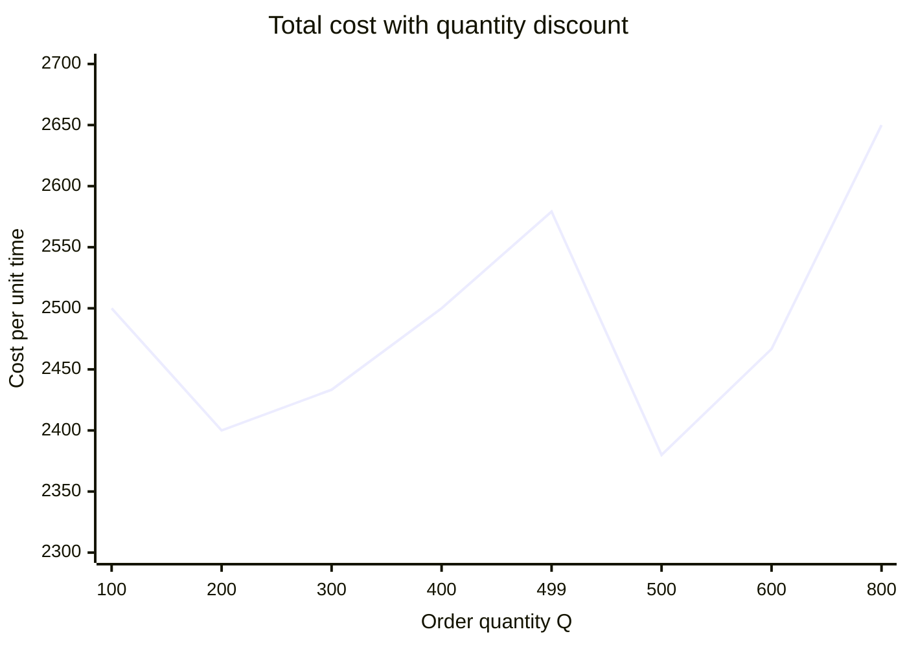

# 早稲田大学 創造理工学研究科 経営システム工学専攻 2016年7月実施 計画数理学 問題9

## **Author**
祭音Myyura

## **Description**

需要が単位時間当たり $d$ で連続的に発生し、発注から $p$ 単位時間後に発注量 $Q$ が入荷する基本的な在庫管理問題を考える。単位在庫を単位時間保管する費用を $B$、1回の固定発注費用を $K$ とする。

1. 経済的発注量を導出せよ。
2. $B=2,\ K=1000,\ d=40,\ p=2$ のとき、最適発注量と最適発注間隔を求めよ。
3. 単位購入費用を $A$ とし、$Q\geq V$ なら $A$ が1割引となる。小問2の設定に加え $A=50,\ V=500$ として、費用関数のグラフを用いて最適発注量を求めよ。

## **Kai**

### [小問 1]

時刻0の在庫を $Q$ とし、$m$ 回目の入荷時刻までの期間を $[0,T]$ とする。この期間の総販売量は

$$
\boxed{\text{① }dT}
$$

である。在庫は入荷のたびに $Q$ だけ増え、期間の始点と終点で同じ水準に戻るので

$$
dT=mQ,\qquad
\boxed{\text{② }m=\frac{dT}{Q}}.
$$

在庫量は $Q$ から0まで直線的に減少するため、平均在庫量は

$$
\boxed{\text{③ }\frac{Q}{2}}.
$$

したがって期間 $[0,T]$ の保管費用と発注費用は

$$
\boxed{\text{④ }\frac{BQT}{2}},\qquad
\boxed{\text{⑤ }\frac{KdT}{Q}}
$$

となる。入荷間隔は $Q/d$ であり、入荷の $p$ 時間前に発注するので、$k$ 回目の発注時刻は

$$
\boxed{\text{⑥ }\frac{kQ}{d}-p}
$$

である。単位時間当たりの総費用は

$$
\boxed{\text{⑦ }C(Q)=\frac{BQ}{2}+\frac{Kd}{Q}}.
$$

$Q>0$ で微分すると

$$
C'(Q)=\frac{B}{2}-\frac{Kd}{Q^2},\qquad
C''(Q)=\frac{2Kd}{Q^3}>0.
$$

よって経済的発注量は

$$
\boxed{\text{⑧ }Q^*=\sqrt{\frac{2Kd}{B}}}.
$$

### [小問 2]

$$
Q^*
=\sqrt{\frac{2\cdot1000\cdot40}{2}}
=\boxed{200}.
$$

したがって最適発注間隔は

$$
\frac{Q^*}{d}=\frac{200}{40}
=\boxed{5}.
$$

リードタイムは $p=2$ なので、各入荷の $5-2=3$ 時間後、すなわち在庫量が $dp=80$ になった時点で次回分を発注する。

### [小問 3]

購入費用を含む単位時間当たりの総費用は

$$
C(Q)=
\begin{cases}
\displaystyle Q+\frac{40000}{Q}+2000,
&0<Q<500,\\[6pt]
\displaystyle Q+\frac{40000}{Q}+1800,
&Q\geq500.
\end{cases}
$$

$Q<500$ の範囲では $Q=200$ が最小で、

$$
C(200)=2400.
$$

$Q\geq500$ では、割引後の費用関数の制約なし最小点 $Q=200$ が範囲外にある。この範囲では $C'(Q)>0$ なので、左端 $Q=500$ が最小となり、

$$
C(500)=500+\frac{40000}{500}+1800=2380.
$$

$2380<2400$ であるから、数量割引を利用する方が有利である。したがって

$$
\boxed{Q^*=500}.
$$
