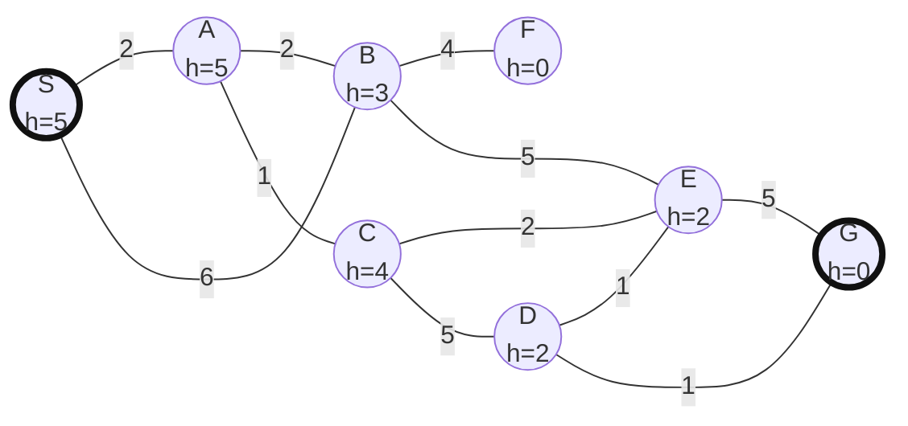

# 早稲田大学 創造理工学研究科 経営システム工学専攻 2016年9月実施 知識情報処理 問題15

## **Author**
祭音Myyura

## **Description**

初期状態を S、ゴール状態を G とし、辺の数字を移動コスト、ノードの括弧内の数字をヒューリスティック値 $h$ とする。

1. 最良優先探索により S から G へ至る経路を求め、オープンリストとクローズドリストの変化を示せ。
2. A* アルゴリズムにより S から G へ至る経路を求め、両リストの変化を示せ。
3. 深さ優先探索、幅優先探索、最良優先探索、A* のオープンリスト管理方法を、指定語句「キュー、スタック、ソート、スタートからある状態までのコストの推定値、ある状態からゴールまでのコストの推定値」をすべて用いて比較せよ。

## **Kai**

同じ評価値の場合には「ヒューリスティック値が小さい状態、さらに同値ならアルファベット順」を優先するものとする。ゴールはオープンリストから取り出した時点で判定する。

### [小問 1]

最良優先探索では、オープンリストを $h(n)$ の昇順にソートする。表中の括弧内は $h$ である。

| 展開した状態 | 展開後のオープンリスト | クローズドリスト |
| --- | --- | --- |
| S | B(3), A(5) | S |
| B | F(0), E(2), A(5) | S, B |
| F | E(2), A(5) | S, B, F |
| E | G(0), D(2), C(4), A(5) | S, B, F, E |
| G | D(2), C(4), A(5) | S, B, F, E, G |

各状態を初めて生成した状態を親とすると、得られる経路は

$$
\boxed{\mathrm{S}\to\mathrm{B}\to\mathrm{E}\to\mathrm{G}}
$$

であり、経路コストは

$$
6+5+5=\boxed{16}
$$

である。最良優先探索は $h$ だけで選ぶため、この経路は最短とは限らない。

### [小問 2]

A* では

$$
f(n)=g(n)+h(n)
$$

を評価値とする。ここで $g(n)$ は S から $n$ までに判明している最小コストである。表中の括弧内は $f$ である。

| 展開した状態 | 展開後のオープンリスト | クローズドリスト |
| --- | --- | --- |
| S | A(7), B(9) | S |
| A | B(7), C(7) | S, A |
| B | C(7), F(8), E(11) | S, A, B |
| C | E(7), F(8), D(10) | S, A, B, C |
| E | F(8), D(8), G(10) | S, A, B, C, E |
| F | D(8), G(10) | S, A, B, C, E, F |
| D | G(7) | S, A, B, C, E, F, D |
| G | - | S, A, B, C, E, F, D, G |

更新された主要なコストは

$$
\begin{aligned}
g(B)&:6\to2+2=4,\\
g(E)&:4+5=9\to2+1+2=5,\\
g(D)&:2+1+5=8\to2+1+2+1=6,\\
g(G)&:5+5=10\to6+1=7.
\end{aligned}
$$

したがって得られる経路は

$$
\boxed{
\mathrm{S}\to\mathrm{A}\to\mathrm{C}\to\mathrm{E}
\to\mathrm{D}\to\mathrm{G}
}
$$

で、経路コストは

$$
2+1+2+1+1=\boxed{7}.
$$

なお、この問題では $h(D)=2$ が D から G への実コスト $1$ を上回るため、ヒューリスティック関数は許容的ではない。したがって A* の一般的な最適性保証は直接には使えないが、この問題で得られたコスト7の経路は、全単純経路を比較しても最短である。

### [小問 3]

| 探索法 | オープンリストの管理 |
| --- | --- |
| 深さ優先探索 | 後から生成した状態を先に取り出す**スタック**を用いる。コストの推定値によるソートは行わない。 |
| 幅優先探索 | 先に生成した状態を先に取り出す**キュー**を用いる。コストの推定値によるソートは行わない。 |
| 最良優先探索 | **ある状態からゴールまでのコストの推定値** $h(n)$ が小さい順にオープンリストを**ソート**する優先度付きキューを用いる。 |
| A* | **スタートからある状態までのコストの推定値** $g(n)$ と、**ある状態からゴールまでのコストの推定値** $h(n)$ の和 $f(n)=g(n)+h(n)$ が小さい順に**ソート**する優先度付きキューを用いる。 |

深さ優先探索と幅優先探索は生成順序だけを使うのに対し、最良優先探索と A* はコスト推定値に基づいて探索順序を変える。A* は到達済みコストと残りコストの両方を考慮する点が最良優先探索と異なる。
