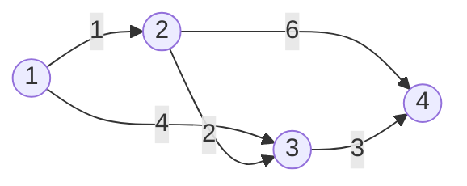

# 早稲田大学 創造理工学研究科 経営システム工学専攻 2017年7月実施 オペレーションズリサーチ 問題8

## **Author**
祭音Myyura

## **Description**

頂点集合 $V=\{1,2,3,4\}$、枝集合

$$
E=\{(1,2),(1,3),(2,3),(2,4),(3,4)\}
$$

を持つ有向グラフを考える。枝上の数字は費用である。

1. 頂点1から頂点4への最短路問題を線形計画問題として定式化せよ。
2. その双対問題を示せ。
3. 最適解において相補性条件が成立することを示せ。

## **Kai**

### [小問 1]

枝 $(i,j)$ を通る流量を $x_{ij}\geq0$ とし、頂点1から1単位を送り、頂点4で1単位を受け取る最小費用流として定式化する。

$$
\begin{array}{ll}
\text{minimize}
&x_{12}+4x_{13}+2x_{23}+6x_{24}+3x_{34}\\
\text{subject to}
&x_{12}+x_{13}=1,\\
&-x_{12}+x_{23}+x_{24}=0,\\
&-x_{13}-x_{23}+x_{34}=0,\\
&-x_{24}-x_{34}=-1,\\
&x_{12},x_{13},x_{23},x_{24},x_{34}\geq0.
\end{array}
$$

最後の保存式は他の3式から従うが、各頂点の意味を明示するため記している。

3本の候補経路の費用は

$$
1\to2\to4:7,\qquad
1\to3\to4:7,\qquad
1\to2\to3\to4:6
$$

なので、最適解は

$$
\boxed{x_{12}=x_{23}=x_{34}=1,quad x_{13}=x_{24}=0},\qquad
\boxed{z^*=6}.
$$

### [小問 2]

各頂点のフロー保存式に対応する自由変数を $y_1,y_2,y_3,y_4$ とする。双対問題は

$$
\begin{array}{ll}
\text{maximize}&y_1-y_4\\
\text{subject to}
&y_1-y_2\leq1,\\
&y_1-y_3\leq4,\\
&y_2-y_3\leq2,\\
&y_2-y_4\leq6,\\
&y_3-y_4\leq3,\\
&y_1,y_2,y_3,y_4\text{ は自由}.
\end{array}
$$

ポテンシャルには定数を加えても制約と目的値が変わらないため、$y_4=0$ と固定してよい。

### [小問 3]

双対解

$$
\boxed{(y_1,y_2,y_3,y_4)=(6,5,3,0)}
$$

は実行可能で、目的値は $6$ である。正のフローを持つ3枝では

$$
y_1-y_2=1=c_{12},\qquad
y_2-y_3=2=c_{23},\qquad
y_3-y_4=3=c_{34}
$$

と双対制約が等号になる。一方、フローが0の枝では

$$
y_1-y_3=3<4=c_{13},\qquad
y_2-y_4=5<6=c_{24}.
$$

したがって全枝について

$$
x_{ij}\{c_{ij}-(y_i-y_j)\}=0
$$

が成立する。これは相補性条件であり、主・双対目的値もともに6なので両解は最適である。
