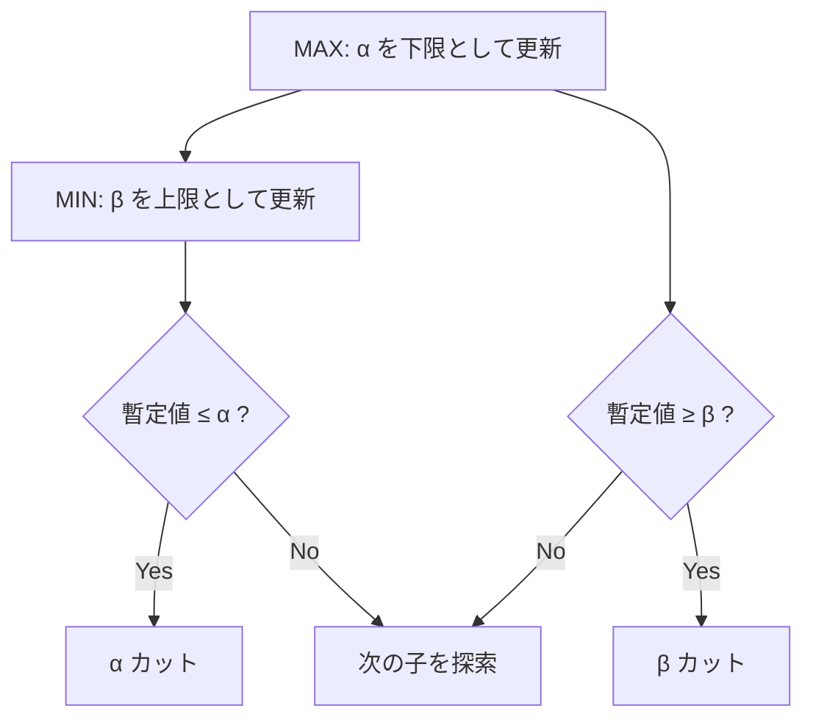

# 早稲田大学 創造理工学研究科 経営システム工学専攻 2017年7月実施 知識情報処理 問題15

## **Author**
祭音Myyura

## **Description**

ゲーム木探索について答えよ。

1. minimax 法を、「局面の評価値」「最も高い評価値」「最も低い評価値」「有利」「不利」をすべて用いて説明せよ。
2. minimax 法で選ばれた手が実際には最善手でない場合がある理由を説明せよ。
3. alpha-beta 法を、「評価値の最も高い手」「評価値の最も低い手」「上限値」「下限値」「$\alpha$ カット」「$\beta$ カット」をすべて用いて説明せよ。

## **Kai**

### [小問 1]

minimax 法は、2人零和・完全情報ゲームで、双方が自分に最も有利で相手に最も不利な手を選ぶと仮定する探索法である。探索木の葉に「局面の評価値」を与え、自分の手番である MAX 節点では子のうち「最も高い評価値」を、相手の手番である MIN 節点では子のうち「最も低い評価値」を親へ戻す。この操作を根まで繰り返し、根の MAX が最大値を与える手を選ぶ。

つまり、自分は最も有利な結果を選ぶ一方、相手も自分にとって最も有利、すなわちこちらにとって最も不利な結果を選ぶと見込んで、最悪の場合の利得を最大化する。

### [小問 2]

有限のゲーム木を終局まで正確に探索し、評価とゲームモデルも正しければ minimax 法は最善手を返す。しかし実際には計算量の制約から途中で探索を打ち切り、終局の真の利得ではなくヒューリスティックな評価関数を用いることが多い。評価誤差や、重要な変化が探索深度の直後に隠れる地平線効果により、選択を誤ることがある。

また、相手が常に最善応手を選ぶという仮定が現実の相手と合わない場合、確率的要素や不完全情報を持つゲームを単純な minimax 木として表した場合にも、実戦上の最善手と一致しないことがある。

### [小問 3]

alpha-beta 法は minimax 値を変えずに、最終選択へ影響しない枝を打ち切る方法である。

- $\alpha$ は MAX 側が既に保証できる評価値の「下限値」であり、MAX 節点で調べた「評価値の最も高い手」により更新する。
- $\beta$ は MIN 側が既に保証できる評価値の「上限値」であり、MIN 節点で調べた「評価値の最も低い手」により更新する。
- MIN 節点で暫定値が $\alpha$ 以下になれば、MAX はその枝を選ばないので、残りを調べない。これが「$\alpha$ カット」である。
- MAX 節点で暫定値が $\beta$ 以上になれば、MIN はその枝を選ばないので、残りを調べない。これが「$\beta$ カット」である。

良い手から調べるほど $\alpha$ と $\beta$ が早く狭まり、より多くの枝を削減できる。ただし探索順序は効率を変えるだけで、得られる minimax 値は変えない。
