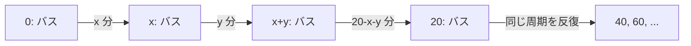

# 早稲田大学 創造理工学研究科 経営システム工学専攻 2019年7月実施 計画数理学 問題10

## **Author**
祭音Myyura

## **Description**

1. AHP の基準 P、Q、R に対する一対比較行列

   $$
   A=\begin{pmatrix}
   1&x&y\\
   1/x&1&1/3\\
   1/y&3&1
   \end{pmatrix},\qquad x,y\in\{1,3,5,7,9\}
   $$

   を考える。
   1. 完全に整合する $(x,y)$ をすべて求め、ウェイト $(w_P,w_Q,w_R)$ を求めよ。
   2. 整合度が最も大きい、すなわち最も不整合な $(x,y)$ を理由とともに答えよ。
2. バスの到着間隔が $x$ 分、$y$ 分、$20-x-y$ 分を周期的に繰り返す。時刻0にバスが到着したとして、$0\leq t\leq60$ の待ち時間 $W(t)$ を示し、その時間平均を求めよ。さらに平均待ち時間を最小にする $x,y$ と最小値を求めよ。

## **Kai**

### [小問 1-1]

完全整合条件は

$$
a_{PR}=a_{PQ}a_{QR}
$$

なので

$$
y=x\cdot\frac13=\frac x3.
$$

$x,y\in\{1,3,5,7,9\}$ を満たす組は

$$
\boxed{(x,y)=(3,1),\ (9,3)}
$$

である。

$(3,1)$ では $w_P/w_Q=3$、$w_Q/w_R=1/3$ なので比は $w_P:w_Q:w_R=3:1:3$、したがって

$$
\boxed{(w_P,w_Q,w_R)=\left(\frac37,\frac17,\frac37\right)}.
$$

$(9,3)$ では比が $9:1:3$ となるので

$$
\boxed{(w_P,w_Q,w_R)=\left(\frac9{13},\frac1{13},\frac3{13}\right)}.
$$

### [小問 1-2]

3基準の循環的整合性は

$$
\rho=\frac{a_{PQ}a_{QR}}{a_{PR}}=\frac{x}{3y}
$$

が1からどれだけ離れるかで決まる。候補中で最も大きい不整合倍率は

$$
\max\left\{\rho,\frac1\rho\right\}
$$

を最大にする $x=1,y=9$ のときで、$1/\rho=27$ となる。したがって整合度が最も大きく、整合性が最も低い組は

$$
\boxed{(x,y)=(1,9)}.
$$

### [小問 2-1]

バス到着時刻は各20分周期で

$$
0,\ x,\ x+y,\ 20,\ 20+x,\ 20+x+y,\ 40,\ldots,60
$$

となる。

$u=t\bmod20$ とすると、バス到着時刻そのものを除いて

$$
W(t)=
\begin{cases}
x-u,&0<u<x,\\
x+y-u,&x<u<x+y,\\
20-u,&x+y<u<20.
\end{cases}
$$

各到着時刻では $W(t)=0$ とする。グラフは各区間の長さを高さとして始まり、傾き $-1$ で0まで下がる3つの鋸歯を1周期とし、$0\leq t\leq60$ ではこれを3回繰り返す。

### [小問 2-2]

1周期のグラフの面積は3つの三角形の面積の和なので、時間平均は

$$
\boxed{
\bar W=\frac{x^2+y^2+(20-x-y)^2}{40}
}.
$$

### [小問 2-3]

3つの到着間隔の和は20である。平方和は3数が等しいときに最小となるため

$$
x=y=20-x-y=\frac{20}{3}.
$$

したがって

$$
\boxed{x=y=\frac{20}{3}\text{ 分}}
$$

で、最小平均待ち時間は

$$
\boxed{
\bar W_{\min}
=\frac{3(20/3)^2}{40}
=\frac{10}{3}\text{ 分}
}.
$$
