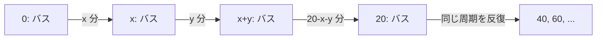

# 早稲田大学 創造理工学研究科 経営システム工学専攻 2019年7月実施 計画数理学 問題10

## **Author**
祭音Myyura

## **Description**

1. AHP の基準 P、Q、R に対する一対比較行列

   $$
   A=\begin{pmatrix}
   1&x&y\\
   1/x&1&1/3\\
   1/y&3&1
   \end{pmatrix},\qquad x,y\in\{1,3,5,7,9\}
   $$

   を考える。
   1. 完全に整合する $(x,y)$ をすべて求め、ウェイト $(w_P,w_Q,w_R)$ を求めよ。
   2. 整合度が最も大きい、すなわち最も不整合な $(x,y)$ を理由とともに答えよ。
2. バスの到着間隔が $x$ 分、$y$ 分、$20-x-y$ 分を周期的に繰り返す。時刻0にバスが到着したとして、$0\leq t\leq60$ の待ち時間 $W(t)$ を示し、その時間平均を求めよ。さらに平均待ち時間を最小にする $x,y$ と最小値を求めよ。

### 题目描述

1. 在层次分析法（AHP）中，评价准则 P、Q、R 的成对比较矩阵为

   $$
   A=\begin{pmatrix}
   1&x&y\\
   1/x&1&1/3\\
   1/y&3&1
   \end{pmatrix},
   \qquad x,y\in\{1,3,5,7,9\}.
   $$

   1. 求使该矩阵完全一致的全部 $(x,y)$，并分别求相应的权重 $(w_P,w_Q,w_R)$。
   2. 求一致性指标最大、也就是最不一致的 $(x,y)$，并说明理由。

2. 公交车的到站间隔按 $x$ 分钟、$y$ 分钟、$20-x-y$ 分钟的顺序周期性重复，并且在时刻 0 有一班车到站。画出或表示 $0\leq t\leq60$ 内的等待时间函数 $W(t)$，求其时间平均；再求使平均等待时间最小的 $x,y$ 以及该最小值。

## **Kai**

### [小問 1-1]

完全整合条件は

$$
a_{PR}=a_{PQ}a_{QR}
$$

なので

$$
y=x\cdot\frac13=\frac x3.
$$

$x,y\in\{1,3,5,7,9\}$ を満たす組は

$$
\boxed{(x,y)=(3,1),\ (9,3)}
$$

である。

$(3,1)$ では $w_P/w_Q=3$、$w_Q/w_R=1/3$ なので比は $w_P:w_Q:w_R=3:1:3$、したがって

$$
\boxed{(w_P,w_Q,w_R)=\left(\frac37,\frac17,\frac37\right)}.
$$

$(9,3)$ では比が $9:1:3$ となるので

$$
\boxed{(w_P,w_Q,w_R)=\left(\frac9{13},\frac1{13},\frac3{13}\right)}.
$$

### [小問 1-2]

3基準の循環的整合性は

$$
\rho=\frac{a_{PQ}a_{QR}}{a_{PR}}=\frac{x}{3y}
$$

が1からどれだけ離れるかで決まる。候補中で最も大きい不整合倍率は

$$
\max\left\{\rho,\frac1\rho\right\}
$$

を最大にする $x=1,y=9$ のときで、$1/\rho=27$ となる。したがって整合度が最も大きく、整合性が最も低い組は

$$
\boxed{(x,y)=(1,9)}.
$$

### [小問 2-1]

各到着間隔が正であるため、$x>0, y>0, x+y<20$ とする。

バス到着時刻は各20分周期で

$$
0,\ x,\ x+y,\ 20,\ 20+x,\ 20+x+y,\ 40,\ldots,60
$$

となる。

```mermaid
flowchart LR
    b0["0: バス"] -->|"x 分"| b1["x: バス"]
    b1 -->|"y 分"| b2["x+y: バス"]
    b2 -->|"20-x-y 分"| b3["20: バス"]
    b3 -->|"同じ周期を反復"| b4["40, 60, ..."]
```

$u=t\bmod20$ とする。時刻0をバス到着の直後とし、各到着直後の値を採る右連続の表示を用いる。

$$
W(t)=
\begin{cases}
x-u,&0\leq u<x,\\
x+y-u,&x\leq u<x+y,\\
20-u,&x+y\leq u<20.
\end{cases}
$$

したがって $W(0)=W(20)=W(40)=W(60)=x$ である。ちょうど到着したバスに乗れるという別の約束ならその瞬間の待ち時間を0とするが、有限個の点の値は時間平均に影響しない。グラフは各区間の長さを高さとして始まり、傾き $-1$ で0まで下がる3つの鋸歯を1周期とし、$0\leq t\leq60$ ではこれを3回繰り返す。

### [小問 2-2]

1周期のグラフの面積は3つの三角形の面積の和なので、時間平均は

$$
\boxed{
\bar W=\frac{x^2+y^2+(20-x-y)^2}{40}
}.
$$

### [小問 2-3]

3つの到着間隔の和は20である。平方和は3数が等しいときに最小となるため

$$
x=y=20-x-y=\frac{20}{3}.
$$

したがって

$$
\boxed{x=y=\frac{20}{3}\text{ 分}}
$$

で、最小平均待ち時間は

$$
\boxed{
\bar W_{\min}
=\frac{3(20/3)^2}{40}
=\frac{10}{3}\text{ 分}
}.
$$
